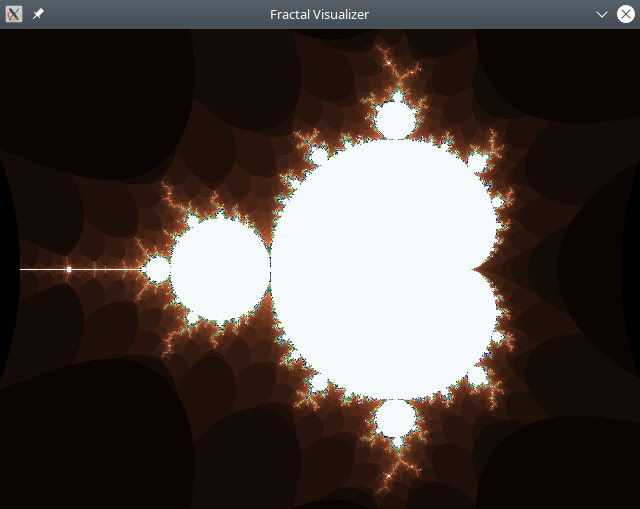
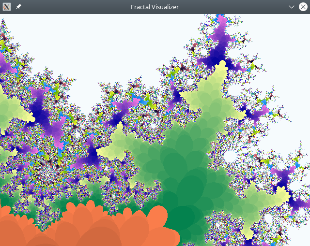

# The Perpetual Project

LLM-driven software development helper.

This project is currently in an early stage of development, and users should expect to encounter various bugs and issues. The author(s) make no guarantees about the reliability, security, or suitability of this project for any particular use case.

## Description

**Perpetual** is an LLM assistant created to boost the productivity and efficiency of software developers. Its key feature is the ability to write and modify code based on textual descriptions provided by the programmer. **Perpetual** can automatically generate new code, make changes to existing code, and even create new files - all by analyzing the project’s codebase and the programmer’s instructions embedded as special comments. With **Perpetual**, developers can focus on high-level problem-solving while the AI assistant handles the tedious task of implementing the required functionality.

**Perpetual** is primarily focused on direct interaction with the project’s codebase, without requiring any additional tools or server infrastructure (except the LLM access). This design allows **Perpetual** to remain simple and easily integrate into larger systems.

All of **Perpetual’s** operations are limited to the user’s project directory, and it is not permitted to delete any files (at least for now).

**[TL;DR, go straight to Example](#example)**

## Limitations

Given **Perpetual’s** focus on direct codebase interaction and maintaining simplicity, the following limitations apply:

- It cannot install packages (npm, NuGet, etc.)
- It cannot set up the necessary development environment
- It cannot interact with version control systems (Git, SVN, etc.)
- It cannot execute arbitrary commands on the user’s machine
- It provides only a command-line interface, which was chosen to preserve simplicity and enable integration
- Other user interface options are not currently planned

Implementing of such functionality is not currently planned

### Current gen LLM Code Writing Limitations

While context window of current gen LLMs may be quite big even to fit all your project at once, response size is still quite limited (usually to 4096 tokens). For now **Perpetual** can only generate code modifications to files as a whole. It expects that LLM will output a whole source code file with modifications. Current gen `Anthropic Claude 3` and `OpenAI GPT-4o` models are good at this task. Next-gen models probably will be even better and will have bigger response size limits, so it is not in priority to implement applying partial generation results to the source files. For now just keep your project source code files well organized and small. Better to have more smaller files than one big. It will also cost you less tokens (and money) to work on smaller files.

### Warning

While **Perpetual** tries to minimize the risk of destructive operations on the user’s computer, there is still a small risk involved. The main danger lies in the unintentional modification of source files based on the LLM’s responses. To reduce this risk, it automatically backs up the files it tries to change and creates a `stash` that can be (re)applied or reverted on command.

Since the LLM never provides a completely deterministic result, and the quality can vary from one run to the next, you may need to run the **Perpetual's** `implement` operation multiple times to achieve a satisfactory result (see below how to use it).

It’s important to remain vigilant and carefully review the changes made by **Perpetual** before integrating them into your codebase.

Note that **Perpetual** is a tool designed mainly to assist programmers, with the primary goal of writing routine code. **Perpetual** is not yet capable of designing the overall project architecture for you, unlike some other similar tools. Instead, **Perpetual** is focused on generating code based on YOUR architectural vision. If you have created a poor architecture in which it is very difficult to create new code, **Perpetual** will likely produce a suboptimal result.

## Requiremens

The key requirement for **Perpetual** is access to a Large Language Model (LLM) to perform the core tasks of code generation and project analysis. Access to LLM models requires API keys for the corresponding LLM provider.

Currently **Perpetual** supports working with OpenAI and Anthropic models. It also supports locally hosted models with Ollama (highly experimental). It was originally developed for the Anthropic models, because of consistent XML tag formatting for responses. So, if using OpenAI - choose the latest GPT-4o model, it formats responses about as well as models from Anthropic. Avoid using GPT-3.5-Turbo and other legacy models - they simply don't work well enough to automate the process of code extraction from LLM responses.

**Perpetual** utilizes the LangChain library for Go, which can be found at the following GitHub project:

<https://github.com/tmc/langchaingo>

This library provides the necessary integration with the LLM, allowing **Perpetual** to leverage the model’s capabilities for its core functionality. Thanks to the LangChain library, it is possible to add other popular LLM providers in future, including models running locally.

The quality of **Perpetual** results directly depends on the LLM used. **Perpetual** allows you to offload different tasks to different models and providers to save on your costs. For example, code annotation or change planning tasks can be performed on more affordable models like Claude 3 Haiku and Claude 3 Sonnet, while the actual code writing can be handled by a more advanced model like Claude 3 Opus or GPT-4o.

## Getting Started

### Obtain API Keys

To get started with **Perpetual**, you need to obtain the necessary API keys to access the LLM models that power the core functionality.

### Download or Compile Perpetual

Next, you need to download or compile the **Perpetual** executable file (you can download binaries from GitHub releases, or latest build from Actions)

### Command Line Usage

**Perpetual** is designed to be used from the command line. To see the available operations, you can simply run the **Perpetual** command without any parameters:

```sh
Perpetual
```

### Initialize a New Project

To initialize a new **Perpetual** project, navigate to the root directory of your project in the console, and run the following command:

```sh
Perpetual init -l <language>
```

The perpetual init command creates a .perpetual directory in the root of your project, which contains various system settings that you can customize as needed:

- Prompts for different operations and stages
- `.env.example` file with example settings
- Regular expressions used for parsing responses from the LLM
- LLM chat logs

Additional files created when executing **Perpetual** operations. **DO NOT ADD THEM TO YOUR VCS** - this is platform dependent files:

- `.annotations.json.` Current annotations generated for your project files.
- `.chatlog.md.` LLM interaction log, see below
- `.raw_message_log.txt.` Raw LLM interaction log, see below

You should be cautious when modifying these settings. You can always rewrite them by running the init operation in the project root directory again.

At the moment, **Perpetual** only supports the Go programming language. Other languages will be added in the future, but you can manually edit the prompt templates to the LLM after initialization to work with projects in other languages.

Next, you need to manually create a `.env` file by copying the `.env.example` file. The `.env` file should be self-explanatory.

### Creating Project Annotations

After initializing a new **Perpetual** project and setting up `.env` file, the next step is to create your project source code annotations. These annotations will be used by the LLM to request relevant files for analysis, which is essential for generating accurate and relevant code, while not overloading LLM context window with unrelevant code.

To create source code annotations, you need to use perpetual annotate command:

```sh
Perpetual annotate
```

**Tip**: Use cheaper models like Claude 3 Haiku for generating annotations. This will be much more cost-effective and faster, because it needed to upload EVERY sutable source code file from your project to LLM in order to generate its summary.

Next time, annotation will be run automatically before other operations, and **it will only re-annotate changed files** in order to minimize costs.

### Writing Code with Perpetual

Key function of **Perpetual** is to assist you in writing code for your project. **Perpetual** can generate code for tasks that are marked in your source code files using the special comment `###IMPLEMENT###` followed by instructions (also comments). It will automatically analyze the code of your project and write its own code in the context of your project. Depending on command line flags it may implement code for all files where `###IMPLEMENT###` comment found, or only for one specific file. It can also create new files to place the code it generate

Example:

```go
func ParseCustomer(jsonMessage string) (Customer,error) {
 //###IMPLEMENT###
 //parse jsonMessage into the Customer struct
 //check all fields in the same way as in the code for adding a new client
 //if reporting error, use helper methods from "reporting" subproject
 //write unit tests in a separate file
}
```

#### Running Perpetual to Implement the Code

To have **Perpetual** generate code for these marked tasks, you need to use `implement` operation. This operation is divided into several stages:

- File Selection: **Perpetual** will use regular expressions from the .perpetual directory to select the project files suitable for processing.
- Annotation Generation: **Perpetual** will generate annotations for the modified files.
- Stage 1: File Analysis: Based on the project-wide description compiled from all annotations and files marked with the `###IMPLEMENT###` comment, the LLM will decide which source code files it needs to study.
- Stage 2: Planning (optional, disabled by default): The requested source code files and files with the `###IMPLEMENT###` comments will be submitted, and an assessment will be made of which files will be created and modified during the implementation process. This stage is needed when you making bigger chganges on multiple files. It is disabled by default to save your money on LLM requests on small tasks. However it also effectively disable LLM to decompose the task and create new files.
- Stage 3: Implementation: All the files requested at Stage 1 + files with `###IMPLEMENT###` comments will be submitted to the LLM, and it will implement the changes one file at a time. The results will be extracted from the response. This process will be repeated iteratively until all the files from stage 2 have been processed.
- Stash creation: both project files that will be overwritten and files generated by LLM are backed up into the stash.
- Applying the results: write LLM-generated files from the newly created stash into the project directory.

Command line example for running full implement operation with stage 2 enabled:

```sh
Perpetual implement -p
```

or

```sh
Perpetual implement -pr
```

### Extra features, tips and tricks

#### Tailoring Annotation Generation for Specific Project Files

Add the following comment near the beginning of your source file (example):

```go
// NOTE for summarization: this file contains sensitive information. So the summary for this file must only say "This file contains `GoPrompts` struct that implement `Prompts` interface. Consider not to use methods from this file directly.", nothing else.
```

You may add similar notes to other code parts. LLM will use that hint to alter generated annotation, it is specifically instructed to do that.

#### Excluding Files from Uploading at Stages 2 and 3

It may be useful to exclude certain files from being uploaded for code analysis during stages 2 and 3. For example, if you have a file where an interface is declared, you may need this interface for use in your tasks, but the structures (if we talking about Go) implementing the interface located in other files are likely not needed - they would only burden the LLM context with unnecessary details and waste extra tokens (and your money). What can you do in this case?

You can mark such files with a special comment `###NOUPLOAD###` anywhere in the file. This will ensure that these files are not uploaded for analysis during stages 2 and 3, even if the LLM requests them during stage 1.

Example for go lang:

```go
//###NOUPLOAD###
```

**Important to note:** even if a file is marked with `###NOUPLOAD###`, it can still be uploaded in some cases:

- when generating annotations. it will be also listed to LLM at Stage 1 in generated project summary (only its annotation)
- when manually selected for implementation using `-r` flag for the `implement` command. This allows you to write code with LLM for such files

**For files you want to completely prevent from being uploaded to the LLM**, you can add a regular expression to the `.perpetual/project_files_blacklist.json` file. This will exclude those files from the list of project files available to **Perpetual**, effectively preventing them from being processed at all. You can verify the exclusion by running the perpetual `annotate` operation with the `-d` flag.

#### Examining logs

**Perpetual** provides detailed logging of LLM interaction. The logs are stored in two different files in the .perpetual directory:

- .chatlog.md: This file contains a human-readable log of the interactions between **Perpetual** and the LLM, in a formatted and simplified manner. It does not include the messages that are repeatedly sent to the LLM for each request. This log is similar to what you would get if you manually conversed with the LLM through a chat interface.
- .raw_message_log.txt: This file contains a raw, unformatted log of the actual messages exchanged between **Perpetual** and the LLM. This log provides a complete record of the communication, including any repeated messages, and can be useful if you need to understand the exact content of the messages sent to the LLM.

## Example

Writing simple Mandelbrot Set Fractal Visualizer in Golang using SDL2 library

### Create main.go draft by yourself

```go
package main

func main() {
	//###IMPLEMENT###
	//generate 2d fractal visualizer using SDL2
	//program must use this SDL2 sdk for rendering: "github.com/veandco/go-sdl2/sdl"

	//implementation notes:
	//implement all calculations of the fractal in a separate file and by using interface, so I may add another fractal implementation later
	//place interface for fractal into one file, and implementation to another. Name interface as "Fractal".
	//create mandelbrot-set fractal that implements the interface.
	//main window size set to 640x480, mind the aspect ration 4:3.
	//make selection of fractal to run from command line.
	//it will be "-m" for mandelbrot-set, use it by default if flag is not provided. add "-h" flag for showing usage
	//program must listen for user controls - w,s,a,d for moving view in 4 directions, q,e for zoom in and zoom out
	//implement user input processing at the separate file.
	//implement rendering at the separate file.
	//try to make small and consise code
}
```

### Perform project initialization

Create go.mod by running

```sh
go mod init fractal
go mod tidy
```

Initialize **Perpetual** project by running

```sh
Perpetual init -l go
```

Prepare your .env file with your Anthropic and/or OpenAI credentials and place it to `.perpetual` directory

### Generate Code

Generate code by running:

```sh
Perpetual implement -pr
```

This will run generation with planning stage and extra reasoning. Expect process to take up to couple of minutes, depending on LLM model you setup for use.

For this example, I chose `Claude 3 Haiku` for annotations and `Claude 3 Sonnet` for reasoning and code generation. It generated the code below, a satisfactory result that compiles with virtually no modifications (missing the necessary imports) and looks decent - I got it on the third try

After generation, I changed initial values for fractal at main.go, center and zoom.

Download missing go packages:

```sh
go mod tidy
```

Example output:

```text
[INF] Project root directory: /mnt/data/Sources/Fractal
[INF] Files for processing:
[INF] main.go
[WRN] All project files selected for processing, no need to run annotate and stage1
[INF] Not creating extra source-code review
[INF] Running stage2: planning changes
[INF] Files to modify selected by LLM:
[INF] main.go (requested by User)
[INF] fractal.go (requested by LLM, new file)
[INF] mandelbrot.go (requested by LLM, new file)
[INF] input.go (requested by LLM, new file)
[INF] render.go (requested by LLM, new file)
[INF] Running stage3: implementing code for: fractal.go
[INF] Running stage3: implementing code for: mandelbrot.go
[INF] Running stage3: implementing code for: input.go
[INF] Running stage3: implementing code for: render.go
[INF] Running stage3: implementing code for: main.go
[INF] Running stage4: applying results
[INF] main.go
[INF] fractal.go
[INF] mandelbrot.go
[INF] input.go
[INF] render.go
```

### Generated files (with very small modifications from me, like removing unneded imports)

#### main.go

```go
package main

import (
	"flag"
	"fmt"

	"github.com/veandco/go-sdl2/sdl"
)

func main() {
	// Parse command-line arguments
	fractalType := flag.String("f", "mandelbrot", "Fractal type (mandelbrot)")
	flag.Parse()

	// Create the fractal instance
	var fractal Fractal
	switch *fractalType {
	case "mandelbrot":
		fractal = &Mandelbrot{centerX: -0.5, centerY: 0, zoom: 200}
	default:
		fmt.Println("Invalid fractal type")
		return
	}

	// Initialize SDL2
	if err := sdl.Init(sdl.INIT_VIDEO); err != nil {
		fmt.Println("Failed to initialize SDL:", err)
		return
	}
	defer sdl.Quit()

	// Create the window
	window, err := sdl.CreateWindow("Fractal Visualizer", sdl.WINDOWPOS_UNDEFINED, sdl.WINDOWPOS_UNDEFINED, 640, 480, sdl.WINDOW_SHOWN)
	if err != nil {
		fmt.Println("Failed to create window:", err)
		return
	}
	defer window.Destroy()

	// Create the renderer
	renderer, err := sdl.CreateRenderer(window, -1, sdl.RENDERER_ACCELERATED)
	if err != nil {
		fmt.Println("Failed to create renderer:", err)
		return
	}
	defer renderer.Destroy()

	// Main loop
	running := true
	for running {
		// Handle events
		for event := sdl.PollEvent(); event != nil; event = sdl.PollEvent() {
			switch event.(type) {
			case *sdl.QuitEvent:
				running = false
			default:
				processInput(fractal, event)
			}
		}

		// Render the fractal
		renderFractal(fractal, renderer)
	}
}
```

#### fractal.go

```go
package main

// Fractal represents the interface for different fractal implementations
type Fractal interface {
	// Calculate returns the number of iterations required for the given point
	Calculate(x, y float64) uint8

	// SetView sets the view parameters for the fractal
	SetView(centerX, centerY, zoom float64)

	// GetView returns the current view parameters of the fractal
	GetView() (centerX, centerY, zoom float64)
}
```

#### mandelbrot.go

```go
package main

// Mandelbrot represents the Mandelbrot fractal set
type Mandelbrot struct {
	centerX, centerY, zoom float64
}

// Calculate calculates the number of iterations required for the given point
func (m *Mandelbrot) Calculate(x, y float64) uint8 {
	cx, cy := m.scale(x, y)
	var zx, zy complex128 = complex(cx, cy), 0
	iterations := uint8(0)

	for iterations < 255 {
		zx, zy = zx*zx+zy*zy+complex(cx, cy), 2*zx*zy
		if real(zx)*real(zx)+real(zy)*real(zy) > 4 {
			break
		}
		iterations++
	}

	return iterations
}

// SetView sets the view parameters for the fractal
func (m *Mandelbrot) SetView(centerX, centerY, zoom float64) {
	m.centerX, m.centerY, m.zoom = centerX, centerY, zoom
}

// GetView returns the current view parameters of the fractal
func (m *Mandelbrot) GetView() (centerX, centerY, zoom float64) {
	return m.centerX, m.centerY, m.zoom
}

// scale scales the given point based on the current view parameters
func (m *Mandelbrot) scale(x, y float64) (float64, float64) {
	return (x-320)/m.zoom + m.centerX, (y-240)/m.zoom + m.centerY
}
```

#### input.go

```go
package main

import (
	"github.com/veandco/go-sdl2/sdl"
)

func processInput(fractal Fractal, event sdl.Event) {
	switch event.GetType() {
	case sdl.KEYDOWN:
		switch event.(*sdl.KeyboardEvent).Keysym.Sym {
		case sdl.K_w:
			centerX, centerY, zoom := fractal.GetView()
			fractal.SetView(centerX, centerY-1/zoom, zoom)
		case sdl.K_s:
			centerX, centerY, zoom := fractal.GetView()
			fractal.SetView(centerX, centerY+1/zoom, zoom)
		case sdl.K_a:
			centerX, centerY, zoom := fractal.GetView()
			fractal.SetView(centerX-10/zoom, centerY, zoom)
		case sdl.K_d:
			centerX, centerY, zoom := fractal.GetView()
			fractal.SetView(centerX+10/zoom, centerY, zoom)
		case sdl.K_q:
			centerX, centerY, zoom := fractal.GetView()
			fractal.SetView(centerX, centerY, zoom*0.5)
		case sdl.K_e:
			centerX, centerY, zoom := fractal.GetView()
			fractal.SetView(centerX, centerY, zoom/0.5)
		}
	}
}
```

#### renderer.go

```go
package main

import (
	"github.com/veandco/go-sdl2/sdl"
)

func renderFractal(fractal Fractal, renderer *sdl.Renderer) {
	// Clear the renderer
	renderer.Clear()

	// Render each pixel
	for y := 0; y < 480; y++ {
		for x := 0; x < 640; x++ {
			// Calculate the fractal value for the current pixel
			iterations := fractal.Calculate(float64(x), float64(y))

			// Set the pixel color based on the fractal value
			color := sdl.Color{
				R: uint8(iterations * 10),
				G: uint8(iterations * 5),
				B: uint8(iterations * 3),
				A: 255,
			}

			// Draw the pixel
			renderer.SetDrawColor(color.R, color.G, color.B, color.A)
			renderer.DrawPoint(int32(x), int32(y))
		}
	}

	// Present the rendered frame
	renderer.Present()
}
```

#### go.mod (created by me)

```text
module fractal

go 1.22.3

require github.com/veandco/go-sdl2 v0.4.38
```

### Screenshots




### Let's add Julia Set Fractal

Add following text to the top of `mandelbrot.go` (right after `package main`):

```text
//###IMPLEMENT###
//implement Julia Set fractal at separate file, same way as Mandelbrot
//add it to fractal selection at main
```

### Generate Code

Generate code by running:

```sh
Perpetual implement -p
```

This will run generation with planning stage without extra reasonings. This makes it less likely that the reasoning will be incorrect. This way it won't mess up the implementation at Stage 3.

Example output:

```text
[INF] Project root directory: /mnt/data/Sources/Fractal
[INF] Files for processing:
[INF] mandelbrot.go
[INF] Project root directory: /mnt/data/Sources/Fractal
[INF] Annotating files, count: 5
[INF] fractal.go
[INF] input.go
[INF] main.go
[INF] mandelbrot.go
[INF] render.go
[INF] Saving annotations
[INF] Running stage1: find project files for review
[INF] Files requested by LLM:
[WRN] Not adding file for review, it is not found in filtered project file-list: julia.go
[INF] main.go
[INF] input.go
[INF] render.go
[INF] Running stage2: planning changes
[INF] Files to modify selected by LLM:
[INF] julia.go (requested by LLM, new file)
[INF] main.go (requested by LLM)
[INF] Running stage3: implementing code for: julia.go
[INF] Running stage3: implementing code for: main.go
[INF] Running stage4: applying results
[INF] julia.go
[INF] main.go
```

#### julia.go

```go
package main

// Julia represents the Julia fractal set
type Julia struct {
	centerX, centerY, zoom float64
	cX, cY                 float64 // Julia set constants
}

// Calculate calculates the number of iterations required for the given point
func (j *Julia) Calculate(x, y float64) uint8 {
	cx, cy := j.scale(x, y)
	var zx, zy complex128 = complex(cx, cy), 0
	iterations := uint8(0)

	for iterations < 255 {
		zx, zy = zx*zx+zy*zy+complex(j.cX, j.cY), 2*zx*zy
		if real(zx)*real(zx)+real(zy)*real(zy) > 4 {
			break
		}
		iterations++
	}

	return iterations
}

// SetView sets the view parameters for the fractal
func (j *Julia) SetView(centerX, centerY, zoom float64) {
	j.centerX, j.centerY, j.zoom = centerX, centerY, zoom
}

// GetView returns the current view parameters of the fractal
func (j *Julia) GetView() (centerX, centerY, zoom float64) {
	return j.centerX, j.centerY, j.zoom
}

// SetConstants sets the Julia set constants
func (j *Julia) SetConstants(cX, cY float64) {
	j.cX, j.cY = cX, cY
}

// scale scales the given point based on the current view parameters
func (j *Julia) scale(x, y float64) (float64, float64) {
	return (x-320)/j.zoom + j.centerX, (y-240)/j.zoom + j.centerY
}
```

This time decent code was produced from the 1st time.

#### main.go

```go
...
	// Parse command-line arguments
	fractalType := flag.String("f", "mandelbrot", "Fractal type (mandelbrot, julia)")
	flag.Parse()

	// Create the fractal instance
	var fractal Fractal
	switch *fractalType {
	case "mandelbrot":
		fractal = &Mandelbrot{centerX: -0.5, centerY: 0, zoom: 200}
	case "julia":
		fractal = &Julia{centerX: 0, centerY: 0, zoom: 200, cX: -0.8, cY: 0.156}
	default:
		fmt.Println("Invalid fractal type")
		return
	}
...
```

Note: I've also played a bit with default parameters (center, zoom, cX, cY)

### Screenshot


## Conclusion

This project was an experiment. A significant portion of the project’s code was written using an LLM (Claude 3), which is where the name **Perpetual** came from. Despite my many years of programming experience, Go was a new language for me, and this was my first program written in it. As a result, the quality of the project’s code is, as expected, quite poor.

This was a learning experience for me, as I explored the capabilities and limitations of using an LLM to assist with code generation. While the LLM was able to help me write the code, the overall quality and architecture of the project suffered due to my own lack of familiarity with the language and best practices

This README is also written by using LLM.

## Disclaimer

This project and its associated materials are provided “as is” and without warranty of any kind, either expressed or implied. The author(s) do not accept any liability for any issues, damages, or losses that may arise from the use of this project or its components. Users are responsible for their own use of the project and should exercise caution and due diligence when incorporating any of the provided code or functionality into their own projects.

The project is intended for educational and experimental purposes only. It should not be used in production environments or for any mission-critical applications without thorough testing and validation. The author(s) make no guarantees about the reliability, security, or suitability of this project for any particular use case.

Users are encouraged to review the project’s documentation, logs, and source code carefully before relying on it. If you encounter any problems or have suggestions for improvement, please feel free to reach out to the project maintainers.
