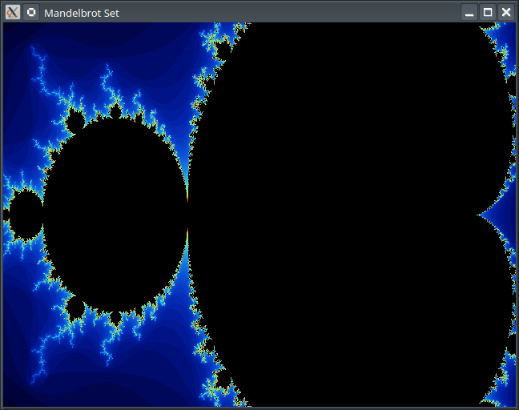
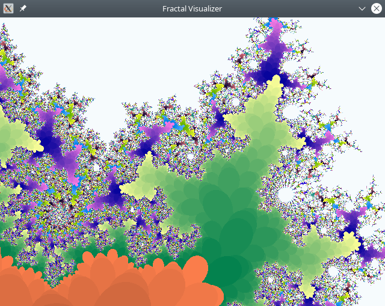
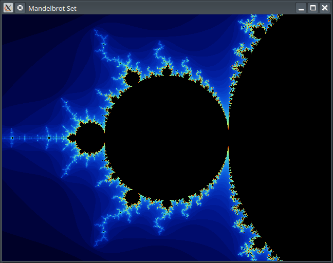
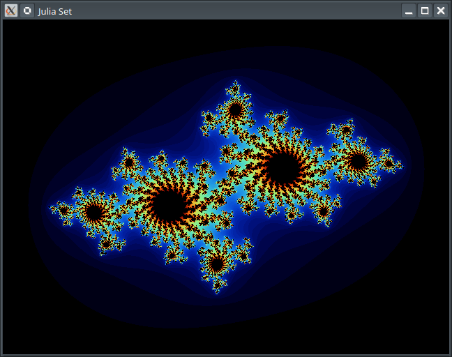

# Example

Creating a Simple Mandelbrot Set Fractal Visualizer in Golang Using the SDL2 Library.

**NOTE**: This example does not aim to be fully optimal or mathematically precise. It is intended to demonstrate how to write code from scratch using an LLM with the `Perpetual` utility.

## Create `main.go` Draft

```go
package main

func main() {
	//###IMPLEMENT###
	//generate 2d fractal visualizer using SDL2
	//program must use this SDL2 sdk for rendering: "github.com/veandco/go-sdl2/sdl"

	//implementation notes:
	//implement all calculations of the fractal in a separate file and by using interface, so I may add another fractal implementation later
	//place interface for fractal into one file, and implementation to another. Name interface as "Fractal".
	//create mandelbrot-set fractal that implements the interface.
	//main window size set to 640x480, mind the aspect ration 4:3.
	//make selection of fractal to run from command line.
	//it will be "-m" for mandelbrot-set, use it by default if flag is not provided. add "-h" flag for showing usage
	//program must listen for user controls - w,s,a,d for moving view in 4 directions, q,e for zoom in and zoom out
	//implement user input processing at the separate file.
	//implement rendering at the separate file.
	//try to make small and consise code
}
```

## Perform Project Initialization

Initialize the Go module by running:

```sh
go mod init fractal
go mod tidy
```

Initialize the **Perpetual** project by running:

```sh
Perpetual init -l go
```

Prepare your `.env` file with your Anthropic and/or OpenAI credentials and place it in the `.perpetual` directory. Use the `.perpetual/.env.example` file as a reference for all supported options. In this example, the Anthropic provider is used with the `claude-3-haiku-20240307` model for annotations and the `claude-3-7-sonnet-latest` model for all other tasks.

### Generate Code

Generate code by running:

```sh
Perpetual implement -pr
```

**Example Output:**

```text
[00.000] [INF] Project root directory: /mnt/data/Sources/Fractal
[00.000] [WRN] Not loading missing env file: /mnt/data/Sources/Fractal/.perpetual/.env
[00.003] [INF] Loaded env file: /home/user/.config/Perpetual/.env
[00.003] [INF] Files for processing:
[00.003] [INF] main.go
[00.003] [WRN] All project files selected for processing, no need to run annotate and stage1
[00.004] [INF] Not adding any source code files for review
[00.004] [INF] Running stage2: generating work plan
[00.004] [INF] [provider:anthropic] [model:claude-3-7-sonnet-latest] [segments:3] [retries:3] [temperature:0.5] [max tokens:1536] [think:disabled] [variants:1] [strategy:SHORT] [format:plain]
[09.158] [INF] Running stage3: generating list of files for processing
[09.158] [INF] [provider:anthropic] [model:claude-3-7-sonnet-latest] [segments:3] [retries:3] [temperature:0.2] [max tokens:512] [think:disabled] [variants:1] [strategy:SHORT] [format:plain]
[11.376] [INF] Files for processing selected by LLM:
[11.376] [INF] fractal.go (new file)
[11.376] [INF] mandelbrot.go (new file)
[11.376] [INF] input.go (new file)
[11.376] [INF] renderer.go (new file)
[11.376] [INF] config.go (new file)
[11.376] [INF] Running stage4: implementing code
[11.377] [INF] [provider:anthropic] [model:claude-3-7-sonnet-latest] [segments:3] [retries:3] [temperature:0.5] [max tokens:8192] [think:disabled] [variants:1] [strategy:SHORT] [format:plain]
[11.377] [INF] fractal.go
[17.522] [INF] mandelbrot.go
[28.381] [INF] input.go
[36.091] [INF] renderer.go
[49.954] [INF] config.go
[55.230] [INF] main.go
[63.952] [INF] Creating new stash from generated results
[63.953] [INF] Files backed up:
[63.953] [INF] main.go
[63.954] [INF] Processing stash: 2025-02-28_13-25-11
[63.954] [INF] Applying changes
[63.954] [INF] input.go
[63.954] [INF] renderer.go
[63.955] [INF] config.go
[63.955] [INF] main.go
[63.955] [INF] fractal.go
[63.955] [INF] mandelbrot.go
```

This process runs generation with the planning stage and extra reasoning. Expect it to take up to a couple of minutes, depending on the LLM model you have set up.

**Note**: Because LLM generation is not deterministic, you may need to run generation multiple times to achieve satisfactory results. In this example, the `explain` operation is used to find solutions to the problems encountered.

Next, download missing Go packages:

```sh
go mod tidy
```

## Generated Files (With Minor Modifications)

### `main.go`

```go
package main

import (
	"flag"
	"fmt"
	"os"

	"github.com/veandco/go-sdl2/sdl"
)

func main() {
	// Parse command line flags
	mandelbrotFlag := flag.Bool("m", false, "Use Mandelbrot set fractal (default)")
	helpFlag := flag.Bool("h", false, "Show usage information")
	flag.Parse()

	// Show help if requested
	if *helpFlag {
		fmt.Println("2D Fractal Visualizer")
		fmt.Println("Controls:")
		fmt.Println("  W, S, A, D - Move the view up, down, left, right")
		fmt.Println("  Q, E - Zoom in, zoom out")
		fmt.Println("  ESC - Quit the application")
		fmt.Println("\nCommand line options:")
		flag.PrintDefaults()
		return
	}

	// Initialize SDL
	if err := sdl.Init(sdl.INIT_EVERYTHING); err != nil {
		fmt.Fprintf(os.Stderr, "Failed to initialize SDL: %!s(MISSING)\n", err)
		os.Exit(1)
	}
	defer sdl.Quit()

	// Load configuration
	config := NewDefaultConfig()

	// Create fractal implementation
	// Currently only Mandelbrot is implemented, but the flag is kept for future extensions
	var fractal Fractal
	if *mandelbrotFlag || true {
		fractal = NewMandelbrot()
	}

	// Create renderer
	renderer, err := NewRenderer(fractal, config.WindowWidth, config.WindowHeight)
	if err != nil {
		fmt.Fprintf(os.Stderr, "Failed to create renderer: %!s(MISSING)\n", err)
		os.Exit(1)
	}
	defer renderer.Close()

	// Create input handler
	inputHandler := NewInputHandler(fractal)

	// Main application loop
	running := true
	for running {
		// Process input
		if inputHandler.ProcessInput() {
			running = false
		}

		// Render the fractal
		renderer.Render()

		// Limit frame rate
		sdl.Delay(16) // ~60 FPS
	}
}
```

### `fractal.go`

```go
package main

// Fractal interface defines the methods that any fractal implementation must provide
type Fractal interface {
	// Calculate returns the iteration count for a given point in the complex plane
	Calculate(x, y float64) int

	// GetMaxIterations returns the maximum number of iterations used for calculation
	GetMaxIterations() int

	// SetMaxIterations sets the maximum number of iterations for calculation
	SetMaxIterations(iterations int)

	// GetCenter returns the current center coordinates of the view
	GetCenter() (float64, float64)

	// SetCenter sets the center coordinates of the view
	SetCenter(x, y float64)

	// GetZoom returns the current zoom level
	GetZoom() float64

	// SetZoom sets the zoom level
	SetZoom(zoom float64)

	// ZoomIn increases the zoom level by a factor
	ZoomIn(factor float64)

	// ZoomOut decreases the zoom level by a factor
	ZoomOut(factor float64)

	// MoveUp shifts the view upward
	MoveUp(amount float64)

	// MoveDown shifts the view downward
	MoveDown(amount float64)

	// MoveLeft shifts the view to the left
	MoveLeft(amount float64)

	// MoveRight shifts the view to the right
	MoveRight(amount float64)

	// GetName returns the name of the fractal
	GetName() string
}
```

### mandelbrot.go

```go
package main

import (
	"math"
	"math/cmplx"
)

// Mandelbrot implements the Fractal interface for the Mandelbrot set
type Mandelbrot struct {
	maxIterations int
	centerX       float64
	centerY       float64
	zoom          float64
}

// NewMandelbrot creates a new Mandelbrot fractal with default settings
func NewMandelbrot() *Mandelbrot {
	return &Mandelbrot{
		maxIterations: 100,
		centerX:       -0.5,
		centerY:       0.0,
		zoom:          1.0,
	}
}

// Calculate returns the iteration count for a given point in the complex plane
func (m *Mandelbrot) Calculate(x, y float64) int {
	// Convert screen coordinates to complex plane coordinates
	zx := x/m.zoom + m.centerX
	zy := y/m.zoom + m.centerY

	// Mandelbrot formula: z = z² + c
	c := complex(zx, zy)
	z := complex(0, 0)

	for i := 0; i < m.maxIterations; i++ {
		z = z*z + c
		// If the point escapes to infinity, return the iteration count
		if cmplx.Abs(z) > 2 {
			return i
		}
	}

	// Point is in the Mandelbrot set
	return m.maxIterations
}

// GetMaxIterations returns the maximum number of iterations used for calculation
func (m *Mandelbrot) GetMaxIterations() int {
	return m.maxIterations
}

// SetMaxIterations sets the maximum number of iterations for calculation
func (m *Mandelbrot) SetMaxIterations(iterations int) {
	m.maxIterations = iterations
}

// GetCenter returns the current center coordinates of the view
func (m *Mandelbrot) GetCenter() (float64, float64) {
	return m.centerX, m.centerY
}

// SetCenter sets the center coordinates of the view
func (m *Mandelbrot) SetCenter(x, y float64) {
	m.centerX = x
	m.centerY = y
}

// GetZoom returns the current zoom level
func (m *Mandelbrot) GetZoom() float64 {
	return m.zoom
}

// SetZoom sets the zoom level
func (m *Mandelbrot) SetZoom(zoom float64) {
	m.zoom = zoom
}

// ZoomIn increases the zoom level by a factor
func (m *Mandelbrot) ZoomIn(factor float64) {
	m.zoom *= factor
}

// ZoomOut decreases the zoom level by a factor
func (m *Mandelbrot) ZoomOut(factor float64) {
	m.zoom /= factor
}

// MoveUp shifts the view upward
func (m *Mandelbrot) MoveUp(amount float64) {
	m.centerY -= amount / m.zoom
}

// MoveDown shifts the view downward
func (m *Mandelbrot) MoveDown(amount float64) {
	m.centerY += amount / m.zoom
}

// MoveLeft shifts the view to the left
func (m *Mandelbrot) MoveLeft(amount float64) {
	m.centerX -= amount / m.zoom
}

// MoveRight shifts the view to the right
func (m *Mandelbrot) MoveRight(amount float64) {
	m.centerX += amount / m.zoom
}

// GetName returns the name of the fractal
func (m *Mandelbrot) GetName() string {
	return "Mandelbrot Set"
}
```

### `input.go`

```go
package main

import (
	"github.com/veandco/go-sdl2/sdl"
)

// InputHandler processes keyboard events and applies them to the fractal
type InputHandler struct {
	fractal Fractal
	moveAmount float64
	zoomFactor float64
}

// NewInputHandler creates a new input handler for the given fractal
func NewInputHandler(fractal Fractal) *InputHandler {
	return &InputHandler{
		fractal:     fractal,
		moveAmount:  0.1,
		zoomFactor:  1.2,
	}
}

// HandleEvent processes a single SDL event and returns true if the application should quit
func (ih *InputHandler) HandleEvent(event sdl.Event) bool {
	switch e := event.(type) {
	case *sdl.QuitEvent:
		return true
	case *sdl.KeyboardEvent:
		if e.Type == sdl.KEYDOWN {
			return ih.handleKeyDown(e.Keysym.Sym)
		}
	}
	return false
}

// handleKeyDown processes keyboard input when a key is pressed
func (ih *InputHandler) handleKeyDown(key sdl.Keycode) bool {
	switch key {
	case sdl.K_ESCAPE:
		return true
	case sdl.K_w:
		ih.fractal.MoveUp(ih.moveAmount)
	case sdl.K_s:
		ih.fractal.MoveDown(ih.moveAmount)
	case sdl.K_a:
		ih.fractal.MoveLeft(ih.moveAmount)
	case sdl.K_d:
		ih.fractal.MoveRight(ih.moveAmount)
	case sdl.K_q:
		ih.fractal.ZoomIn(ih.zoomFactor)
	case sdl.K_e:
		ih.fractal.ZoomOut(ih.zoomFactor)
	}
	return false
}

// ProcessInput handles all pending SDL events
func (ih *InputHandler) ProcessInput() bool {
	for event := sdl.PollEvent(); event != nil; event = sdl.PollEvent() {
		if ih.HandleEvent(event) {
			return true
		}
	}
	return false
}
```

### `renderer.go`

```go
package main

import (
	"github.com/veandco/go-sdl2/sdl"
)

// Renderer handles the rendering of fractals to the screen
type Renderer struct {
	window   *sdl.Window
	renderer *sdl.Renderer
	width    int32
	height   int32
	fractal  Fractal
	colorMap []sdl.Color
}

// NewRenderer creates a new renderer for the given fractal
func NewRenderer(fractal Fractal, width, height int32) (*Renderer, error) {
	window, err := sdl.CreateWindow(
		fractal.GetName(),
		sdl.WINDOWPOS_UNDEFINED, sdl.WINDOWPOS_UNDEFINED,
		width, height,
		sdl.WINDOW_SHOWN,
	)
	if err != nil {
		return nil, err
	}

	renderer, err := sdl.CreateRenderer(window, -1, sdl.RENDERER_ACCELERATED)
	if err != nil {
		window.Destroy()
		return nil, err
	}

	r := &Renderer{
		window:   window,
		renderer: renderer,
		width:    width,
		height:   height,
		fractal:  fractal,
		colorMap: generateColorMap(fractal.GetMaxIterations()),
	}

	return r, nil
}

// Render draws the fractal to the screen
func (r *Renderer) Render() {
	r.renderer.Clear()

	// Calculate aspect ratio adjustment
	aspectRatio := float64(r.width) / float64(r.height)
	
	for y := int32(0); y < r.height; y++ {
		for x := int32(0); x < r.width; x++ {
			// Convert screen coordinates to fractal coordinates
			// Adjust x-coordinate for aspect ratio
			fx := (float64(x) - float64(r.width)/2) / float64(r.height) * aspectRatio
			fy := (float64(y) - float64(r.height)/2) / float64(r.height)
			
			// Calculate fractal value for this pixel
			iterations := r.fractal.Calculate(fx, fy)
			
			// Set color based on iteration count
			if iterations < r.fractal.GetMaxIterations() {
				color := r.colorMap[iterations%!l(MISSING)en(r.colorMap)]
				r.renderer.SetDrawColor(color.R, color.G, color.B, 255)
			} else {
				// Points in the set are black
				r.renderer.SetDrawColor(0, 0, 0, 255)
			}
			
			r.renderer.DrawPoint(x, y)
		}
	}

	r.renderer.Present()
}

// Close cleans up resources used by the renderer
func (r *Renderer) Close() {
	r.renderer.Destroy()
	r.window.Destroy()
}

// UpdateColorMap regenerates the color map if the max iterations change
func (r *Renderer) UpdateColorMap() {
	r.colorMap = generateColorMap(r.fractal.GetMaxIterations())
}

// generateColorMap creates a smooth color palette for visualizing the fractal
func generateColorMap(maxIterations int) []sdl.Color {
	colors := make([]sdl.Color, maxIterations)
	
	for i := 0; i < maxIterations; i++ {
		// Create a smooth color gradient
		t := float64(i) / float64(maxIterations)
		
		// Use a simple HSV to RGB conversion for nice colors
		// This creates a rainbow-like effect
		r := uint8(9 * (1 - t) * t * t * t * 255)
		g := uint8(15 * (1 - t) * (1 - t) * t * t * 255)
		b := uint8(8.5 * (1 - t) * (1 - t) * (1 - t) * t * 255)
		
		colors[i] = sdl.Color{R: r, G: g, B: b, A: 255}
	}
	
	return colors
}
```

### `config.go`

```go
package main

// Config holds the configuration parameters for the fractal visualizer
type Config struct {
	// Window dimensions
	WindowWidth  int32
	WindowHeight int32
}

// NewDefaultConfig creates a new configuration with default values
func NewDefaultConfig() *Config {
	return &Config{
		WindowWidth:  640,
		WindowHeight: 480,
	}
}

// GetAspectRatio returns the aspect ratio of the window
func (c *Config) GetAspectRatio() float64 {
	return float64(c.WindowWidth) / float64(c.WindowHeight)
}
```

### `go.mod` (Created by User)

```text
module fractal

go 1.23.6

require github.com/veandco/go-sdl2 v0.4.40
```

## Screenshot



## Identify and Fix Problems

There appears to be an issue where the fractal is stretched vertically. Let's address this using the `explain` operation.

``````text
echo "Fractal image is stretched vertically. How do I fix it ? Answer shortly" | ../Perpetual/Perpetual explain
[00.000] [INF] Project root directory: /mnt/data/Sources/Fractal
[00.000] [WRN] Not loading missing env file: /mnt/data/Sources/Fractal/.perpetual/.env
[00.002] [INF] Loaded env file: /home/user/.config/Perpetual/.env
[00.002] [INF] Reading question from stdin
[00.003] [INF] Annotating files, count: 6
[00.003] [INF] [provider:anthropic] [model:claude-3-haiku-20240307] [segments:3] [retries:1] [temperature:0.5] [max tokens:768] [think:disabled] [variants:1] [strategy:SHORT] [format:plain]
[00.003] [INF] config.go
[01.913] [INF] fractal.go
[03.088] [INF] input.go
[04.940] [INF] main.go
[06.875] [INF] mandelbrot.go
[10.545] [INF] renderer.go
[12.486] [INF] Saving annotations
[12.487] [INF] Running stage1: find project files for review
[12.487] [INF] [provider:anthropic] [model:claude-3-7-sonnet-latest] [segments:3] [retries:3] [temperature:0.2] [max tokens:512] [think:disabled] [variants:1] [strategy:SHORT] [format:plain]
[15.668] [INF] Files requested by LLM:
[15.668] [INF] config.go
[15.668] [INF] renderer.go
[15.668] [INF] mandelbrot.go
[15.668] [INF] fractal.go
[15.668] [INF] Not adding project-annotations
[15.669] [INF] Running stage2: processing question
[15.669] [INF] [provider:anthropic] [model:claude-3-7-sonnet-latest] [segments:3] [retries:3] [temperature:1] [max tokens:32768] [think tokens:4096] [variants:1] [strategy:SHORT] [format:plain]
# Files

`config.go`

`renderer.go`

`mandelbrot.go`

`fractal.go`

# Answer

The fractal image is stretched vertically because the aspect ratio is only applied to the x-coordinate in the renderer code. To fix this:

In the `renderer.go` file, modify the coordinate conversion in the `Render()` method:

```go
// Change from:
fx := (float64(x) - float64(r.width)/2) / float64(r.height) * aspectRatio
fy := (float64(y) - float64(r.height)/2) / float64(r.height)

// To:
fx := (float64(x)/float64(r.width) - 0.5) / r.fractal.GetZoom() * aspectRatio
fy := (float64(y)/float64(r.height) - 0.5) / r.fractal.GetZoom()
```

This ensures both coordinates are properly scaled according to the aspect ratio, preventing vertical stretching in the rendered fractal.
``````

## Screenshot, after applying fix



In a same way we will try to fix fractal initial position / centering (not posting logs for convenience)

## Screenshot, after applying another fix



## Let's add Julia Set Fractal

Add following text to the top of `mandelbrot.go` (right after `package main`):

```text
//###IMPLEMENT###
//implement Julia Set fractal at separate file, same way as Mandelbrot
//add it to fractal selection at main
```

## Generate Code

Generate code by running:

```sh
Perpetual implement -p
```

This will run generation with multiple files change-planning (`p` flag) but without extra reasonings (`r` flag).

Example output:

```text
[00.000] [INF] Project root directory: /mnt/data/Sources/Fractal
[00.000] [WRN] Not loading missing env file: /mnt/data/Sources/Fractal/.perpetual/.env
[00.002] [INF] Loaded env file: /home/user/.config/Perpetual/.env
[00.003] [INF] Files for processing:
[00.003] [INF] mandelbrot.go
[00.004] [INF] Annotating files, count: 2
[00.004] [INF] [provider:anthropic] [model:claude-3-haiku-20240307] [segments:3] [retries:1] [temperature:0.5] [max tokens:768] [think:disabled] [variants:1] [strategy:SHORT] [format:plain]
[00.004] [INF] mandelbrot.go
[03.484] [INF] renderer.go
[05.348] [INF] Saving annotations
[05.349] [INF] Running stage1: find project files for review
[05.349] [INF] [provider:anthropic] [model:claude-3-7-sonnet-latest] [segments:3] [retries:3] [temperature:0.2] [max tokens:512] [think:disabled] [variants:1] [strategy:SHORT] [format:plain]
[08.656] [INF] Files requested by LLM:
[08.656] [INF] fractal.go
[08.656] [INF] main.go
[08.656] [INF] Running stage3: generating list of files for processing
[08.656] [INF] [provider:anthropic] [model:claude-3-7-sonnet-latest] [segments:3] [retries:3] [temperature:0.2] [max tokens:512] [think:disabled] [variants:1] [strategy:SHORT] [format:plain]
[11.002] [INF] Files for processing selected by LLM:
[11.002] [INF] julia.go (new file)
[11.002] [INF] main.go
[11.002] [INF] Running stage4: implementing code
[11.002] [INF] [provider:anthropic] [model:claude-3-7-sonnet-latest] [segments:3] [retries:3] [temperature:0.5] [max tokens:8192] [think:disabled] [variants:1] [strategy:SHORT] [format:plain]
[11.002] [INF] julia.go
[23.351] [INF] main.go
[32.257] [INF] mandelbrot.go
[43.929] [INF] Creating new stash from generated results
[43.929] [INF] Files backed up:
[43.929] [INF] main.go
[43.929] [INF] mandelbrot.go
[43.930] [INF] Processing stash: 2025-02-28_13-58-20
[43.930] [INF] Applying changes
[43.930] [INF] main.go
[43.930] [INF] mandelbrot.go
[43.930] [INF] julia.go
```

### julia.go

```go
package main

import (
	"math/cmplx"
)

// Julia implements the Fractal interface for the Julia set
type Julia struct {
	maxIterations int
	centerX       float64
	centerY       float64
	zoom          float64
	cx            float64
	cy            float64
}

// NewJulia creates a new Julia fractal with default settings
func NewJulia() *Julia {
	return &Julia{
		maxIterations: 100,
		centerX:       0.0,
		centerY:       0.0,
		zoom:          0.6,
		cx:            -0.687,
		cy:            0.312,
	}
}

// Calculate returns the iteration count for a given point in the complex plane
func (j *Julia) Calculate(x, y float64) int {
	// Convert screen coordinates to complex plane coordinates
	zx := x/j.zoom + j.centerX
	zy := y/j.zoom + j.centerY

	// Julia formula: z = z² + c, where c is a constant
	z := complex(zx, zy)
	c := complex(j.cx, j.cy)

	for i := 0; i < j.maxIterations; i++ {
		z = z*z + c
		// If the point escapes to infinity, return the iteration count
		if cmplx.Abs(z) > 2 {
			return i
		}
	}

	// Point is in the Julia set
	return j.maxIterations
}

// GetMaxIterations returns the maximum number of iterations used for calculation
func (j *Julia) GetMaxIterations() int {
	return j.maxIterations
}

// SetMaxIterations sets the maximum number of iterations for calculation
func (j *Julia) SetMaxIterations(iterations int) {
	j.maxIterations = iterations
}

// GetCenter returns the current center coordinates of the view
func (j *Julia) GetCenter() (float64, float64) {
	return j.centerX, j.centerY
}

// SetCenter sets the center coordinates of the view
func (j *Julia) SetCenter(x, y float64) {
	j.centerX = x
	j.centerY = y
}

// GetZoom returns the current zoom level
func (j *Julia) GetZoom() float64 {
	return j.zoom
}

// SetZoom sets the zoom level
func (j *Julia) SetZoom(zoom float64) {
	j.zoom = zoom
}

// ZoomIn increases the zoom level by a factor
func (j *Julia) ZoomIn(factor float64) {
	j.zoom *= factor
}

// ZoomOut decreases the zoom level by a factor
func (j *Julia) ZoomOut(factor float64) {
	j.zoom /= factor
}

// MoveUp shifts the view upward
func (j *Julia) MoveUp(amount float64) {
	j.centerY -= amount / j.zoom
}

// MoveDown shifts the view downward
func (j *Julia) MoveDown(amount float64) {
	j.centerY += amount / j.zoom
}

// MoveLeft shifts the view to the left
func (j *Julia) MoveLeft(amount float64) {
	j.centerX -= amount / j.zoom
}

// MoveRight shifts the view to the right
func (j *Julia) MoveRight(amount float64) {
	j.centerX += amount / j.zoom
}

// GetName returns the name of the fractal
func (j *Julia) GetName() string {
	return "Julia Set"
}

// SetJuliaConstant sets the constant c used in the Julia set formula
func (j *Julia) SetJuliaConstant(cx, cy float64) {
	j.cx = cx
	j.cy = cy
}

// GetJuliaConstant returns the constant c used in the Julia set formula
func (j *Julia) GetJuliaConstant() (float64, float64) {
	return j.cx, j.cy
}
```

### main.go

```go
package main

import (
	"flag"
	"fmt"
	"os"

	"github.com/veandco/go-sdl2/sdl"
)

func main() {
	// Parse command line flags
	flag.Bool("m", false, "Use Mandelbrot set fractal (default)")
	juliaFlag := flag.Bool("j", false, "Use Julia set fractal")
	helpFlag := flag.Bool("h", false, "Show usage information")
	flag.Parse()

	// Show help if requested
	if *helpFlag {
		fmt.Println("2D Fractal Visualizer")
		fmt.Println("Controls:")
		fmt.Println("  W, S, A, D - Move the view up, down, left, right")
		fmt.Println("  Q, E - Zoom in, zoom out")
		fmt.Println("  ESC - Quit the application")
		fmt.Println("\nCommand line options:")
		flag.PrintDefaults()
		return
	}

	// Initialize SDL
	if err := sdl.Init(sdl.INIT_EVERYTHING); err != nil {
		fmt.Fprintf(os.Stderr, "Failed to initialize SDL: %s\n", err)
		os.Exit(1)
	}
	defer sdl.Quit()

	// Load configuration
	config := NewDefaultConfig()

	// Create fractal implementation
	var fractal Fractal
	if *juliaFlag {
		fractal = NewJulia()
	} else {
		// Default to Mandelbrot if no fractal is specified or if mandelbrot flag is set
		fractal = NewMandelbrot()
	}

	// Create renderer
	renderer, err := NewRenderer(fractal, config.WindowWidth, config.WindowHeight)
	if err != nil {
		fmt.Fprintf(os.Stderr, "Failed to create renderer: %s\n", err)
		os.Exit(1)
	}
	defer renderer.Close()

	// Create input handler
	inputHandler := NewInputHandler(fractal)

	// Main application loop
	running := true
	for running {
		// Process input
		if inputHandler.ProcessInput() {
			running = false
		}

		// Render the fractal
		renderer.Render()

		// Limit frame rate
		sdl.Delay(16) // ~60 FPS
	}
}
```

## Screenshot

Note: I've manually altered some initial parameters (zoom, cx, cy)


