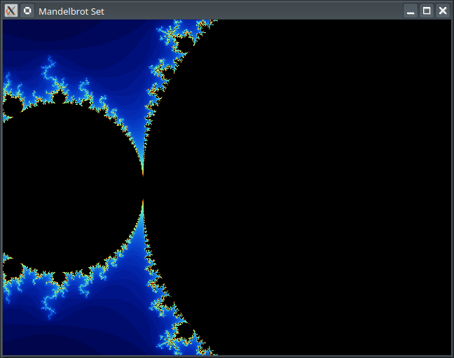

# Example

Writing simple Mandelbrot Set Fractal Visualizer in Golang using SDL2 library

## Create main.go draft by yourself

```go
package main

func main() {
	//###IMPLEMENT###
	//generate 2d fractal visualizer using SDL2
	//program must use this SDL2 sdk for rendering: "github.com/veandco/go-sdl2/sdl"

	//implementation notes:
	//implement all calculations of the fractal in a separate file and by using interface, so I may add another fractal implementation later
	//place interface for fractal into one file, and implementation to another. Name interface as "Fractal".
	//create mandelbrot-set fractal that implements the interface.
	//main window size set to 640x480, mind the aspect ration 4:3.
	//make selection of fractal to run from command line.
	//it will be "-m" for mandelbrot-set, use it by default if flag is not provided. add "-h" flag for showing usage
	//program must listen for user controls - w,s,a,d for moving view in 4 directions, q,e for zoom in and zoom out
	//implement user input processing at the separate file.
	//implement rendering at the separate file.
	//try to make small and consise code
}
```

## Perform project initialization

Create go.mod by running

```sh
go mod init fractal
go mod tidy
```

Initialize **Perpetual** project by running

```sh
Perpetual init -l go
```

Prepare your .env file with your Anthropic and/or OpenAI credentials and place it to `.perpetual` directory. Use `.perpetual/.env.example` file as reference for all supported options.

### Generate Code

Generate code by running:

```sh
Perpetual implement -pr
```

Example output:

```text
[INF] Project root directory: /mnt/data/Sources/Fractal
[INF] Files for processing:
[INF] main.go
[WRN] All project files selected for processing, no need to run annotate and stage1
[INF] Not creating extra source-code review
[INF] Running stage2: planning changes
[INF] Files to modify selected by LLM:
[INF] main.go (requested by User)
[INF] fractal.go (requested by LLM, new file)
[INF] mandelbrot.go (requested by LLM, new file)
[INF] input.go (requested by LLM, new file)
[INF] render.go (requested by LLM, new file)
[INF] Running stage3: implementing code for: fractal.go
[INF] Running stage3: implementing code for: mandelbrot.go
[INF] Running stage3: implementing code for: input.go
[INF] Running stage3: implementing code for: render.go
[INF] Running stage3: implementing code for: main.go
[INF] Running stage4: applying results
[INF] main.go
[INF] fractal.go
[INF] mandelbrot.go
[INF] input.go
[INF] render.go
```

This will run generation with planning stage and extra reasoning. Expect process to take up to couple of minutes, depending on LLM model you setup for use.

For this example, I chose `Claude 3 Haiku` for annotations and `Claude 3 Sonnet` for reasoning and code generation. It generated the code below, a satisfactory result that compiles with virtually no modifications (missing the necessary imports) and looks decent. I got it on the third try

After generation, I changed initial values for fractal at main.go, center and zoom.

Download missing go packages:

```sh
go mod tidy
```

## Generated files (with very small modifications from me, like removing unneded imports)

### main.go

```go
package main

import (
	"flag"
	"fmt"

	"github.com/veandco/go-sdl2/sdl"
)

func main() {
	// Parse command-line arguments
	fractalType := flag.String("f", "mandelbrot", "Fractal type (mandelbrot)")
	flag.Parse()

	// Create the fractal instance
	var fractal Fractal
	switch *fractalType {
	case "mandelbrot":
		fractal = &Mandelbrot{centerX: -0.5, centerY: 0, zoom: 200}
	default:
		fmt.Println("Invalid fractal type")
		return
	}

	// Initialize SDL2
	if err := sdl.Init(sdl.INIT_VIDEO); err != nil {
		fmt.Println("Failed to initialize SDL:", err)
		return
	}
	defer sdl.Quit()

	// Create the window
	window, err := sdl.CreateWindow("Fractal Visualizer", sdl.WINDOWPOS_UNDEFINED, sdl.WINDOWPOS_UNDEFINED, 640, 480, sdl.WINDOW_SHOWN)
	if err != nil {
		fmt.Println("Failed to create window:", err)
		return
	}
	defer window.Destroy()

	// Create the renderer
	renderer, err := sdl.CreateRenderer(window, -1, sdl.RENDERER_ACCELERATED)
	if err != nil {
		fmt.Println("Failed to create renderer:", err)
		return
	}
	defer renderer.Destroy()

	// Main loop
	running := true
	for running {
		// Handle events
		for event := sdl.PollEvent(); event != nil; event = sdl.PollEvent() {
			switch event.(type) {
			case *sdl.QuitEvent:
				running = false
			default:
				processInput(fractal, event)
			}
		}

		// Render the fractal
		renderFractal(fractal, renderer)
	}
}
```

### fractal.go

```go
package main

// Fractal represents the interface for different fractal implementations
type Fractal interface {
	// Calculate returns the number of iterations required for the given point
	Calculate(x, y float64) uint8

	// SetView sets the view parameters for the fractal
	SetView(centerX, centerY, zoom float64)

	// GetView returns the current view parameters of the fractal
	GetView() (centerX, centerY, zoom float64)
}
```

### mandelbrot.go

```go
package main

// Mandelbrot represents the Mandelbrot fractal set
type Mandelbrot struct {
	centerX, centerY, zoom float64
}

// Calculate calculates the number of iterations required for the given point
func (m *Mandelbrot) Calculate(x, y float64) uint8 {
	cx, cy := m.scale(x, y)
	var zx, zy complex128 = complex(cx, cy), 0
	iterations := uint8(0)

	for iterations < 255 {
		zx, zy = zx*zx+zy*zy+complex(cx, cy), 2*zx*zy
		if real(zx)*real(zx)+real(zy)*real(zy) > 4 {
			break
		}
		iterations++
	}

	return iterations
}

// SetView sets the view parameters for the fractal
func (m *Mandelbrot) SetView(centerX, centerY, zoom float64) {
	m.centerX, m.centerY, m.zoom = centerX, centerY, zoom
}

// GetView returns the current view parameters of the fractal
func (m *Mandelbrot) GetView() (centerX, centerY, zoom float64) {
	return m.centerX, m.centerY, m.zoom
}

// scale scales the given point based on the current view parameters
func (m *Mandelbrot) scale(x, y float64) (float64, float64) {
	return (x-320)/m.zoom + m.centerX, (y-240)/m.zoom + m.centerY
}
```

### input.go

```go
package main

import (
	"github.com/veandco/go-sdl2/sdl"
)

func processInput(fractal Fractal, event sdl.Event) {
	switch event.GetType() {
	case sdl.KEYDOWN:
		switch event.(*sdl.KeyboardEvent).Keysym.Sym {
		case sdl.K_w:
			centerX, centerY, zoom := fractal.GetView()
			fractal.SetView(centerX, centerY-1/zoom, zoom)
		case sdl.K_s:
			centerX, centerY, zoom := fractal.GetView()
			fractal.SetView(centerX, centerY+1/zoom, zoom)
		case sdl.K_a:
			centerX, centerY, zoom := fractal.GetView()
			fractal.SetView(centerX-10/zoom, centerY, zoom)
		case sdl.K_d:
			centerX, centerY, zoom := fractal.GetView()
			fractal.SetView(centerX+10/zoom, centerY, zoom)
		case sdl.K_q:
			centerX, centerY, zoom := fractal.GetView()
			fractal.SetView(centerX, centerY, zoom*0.5)
		case sdl.K_e:
			centerX, centerY, zoom := fractal.GetView()
			fractal.SetView(centerX, centerY, zoom/0.5)
		}
	}
}
```

### renderer.go

```go
package main

import (
	"github.com/veandco/go-sdl2/sdl"
)

func renderFractal(fractal Fractal, renderer *sdl.Renderer) {
	// Clear the renderer
	renderer.Clear()

	// Render each pixel
	for y := 0; y < 480; y++ {
		for x := 0; x < 640; x++ {
			// Calculate the fractal value for the current pixel
			iterations := fractal.Calculate(float64(x), float64(y))

			// Set the pixel color based on the fractal value
			color := sdl.Color{
				R: uint8(iterations * 10),
				G: uint8(iterations * 5),
				B: uint8(iterations * 3),
				A: 255,
			}

			// Draw the pixel
			renderer.SetDrawColor(color.R, color.G, color.B, color.A)
			renderer.DrawPoint(int32(x), int32(y))
		}
	}

	// Present the rendered frame
	renderer.Present()
}
```

### go.mod (created by me)

```text
module fractal

go 1.22.3

require github.com/veandco/go-sdl2 v0.4.38
```

## Screenshots




## Let's add Julia Set Fractal

Add following text to the top of `mandelbrot.go` (right after `package main`):

```text
//###IMPLEMENT###
//implement Julia Set fractal at separate file, same way as Mandelbrot
//add it to fractal selection at main
```

## Generate Code

Generate code by running:

```sh
Perpetual implement -p
```

This will run generation with planning stage without extra reasonings. This makes it less likely that the reasoning will be incorrect. This way it won't mess up the implementation at Stage 3.

Example output:

```text
[INF] Project root directory: /mnt/data/Sources/Fractal
[INF] Files for processing:
[INF] mandelbrot.go
[INF] Project root directory: /mnt/data/Sources/Fractal
[INF] Annotating files, count: 5
[INF] fractal.go
[INF] input.go
[INF] main.go
[INF] mandelbrot.go
[INF] render.go
[INF] Saving annotations
[INF] Running stage1: find project files for review
[INF] Files requested by LLM:
[WRN] Not adding file for review, it is not found in filtered project file-list: julia.go
[INF] main.go
[INF] input.go
[INF] render.go
[INF] Running stage2: planning changes
[INF] Files to modify selected by LLM:
[INF] julia.go (requested by LLM, new file)
[INF] main.go (requested by LLM)
[INF] Running stage3: implementing code for: julia.go
[INF] Running stage3: implementing code for: main.go
[INF] Running stage4: applying results
[INF] julia.go
[INF] main.go
```

### julia.go

```go
package main

// Julia represents the Julia fractal set
type Julia struct {
	centerX, centerY, zoom float64
	cX, cY                 float64 // Julia set constants
}

// Calculate calculates the number of iterations required for the given point
func (j *Julia) Calculate(x, y float64) uint8 {
	cx, cy := j.scale(x, y)
	var zx, zy complex128 = complex(cx, cy), 0
	iterations := uint8(0)

	for iterations < 255 {
		zx, zy = zx*zx+zy*zy+complex(j.cX, j.cY), 2*zx*zy
		if real(zx)*real(zx)+real(zy)*real(zy) > 4 {
			break
		}
		iterations++
	}

	return iterations
}

// SetView sets the view parameters for the fractal
func (j *Julia) SetView(centerX, centerY, zoom float64) {
	j.centerX, j.centerY, j.zoom = centerX, centerY, zoom
}

// GetView returns the current view parameters of the fractal
func (j *Julia) GetView() (centerX, centerY, zoom float64) {
	return j.centerX, j.centerY, j.zoom
}

// SetConstants sets the Julia set constants
func (j *Julia) SetConstants(cX, cY float64) {
	j.cX, j.cY = cX, cY
}

// scale scales the given point based on the current view parameters
func (j *Julia) scale(x, y float64) (float64, float64) {
	return (x-320)/j.zoom + j.centerX, (y-240)/j.zoom + j.centerY
}
```

This time decent code was produced from the 1st time.

### main.go

```go
...
	// Parse command-line arguments
	fractalType := flag.String("f", "mandelbrot", "Fractal type (mandelbrot, julia)")
	flag.Parse()

	// Create the fractal instance
	var fractal Fractal
	switch *fractalType {
	case "mandelbrot":
		fractal = &Mandelbrot{centerX: -0.5, centerY: 0, zoom: 200}
	case "julia":
		fractal = &Julia{centerX: 0, centerY: 0, zoom: 200, cX: -0.8, cY: 0.156}
	default:
		fmt.Println("Invalid fractal type")
		return
	}
...
```

Note: I've also played a bit with default parameters (center, zoom, cX, cY)

## Screenshot


