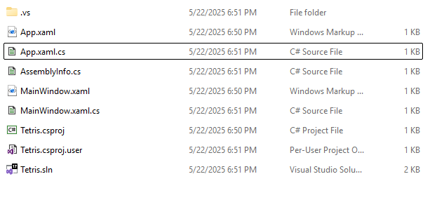
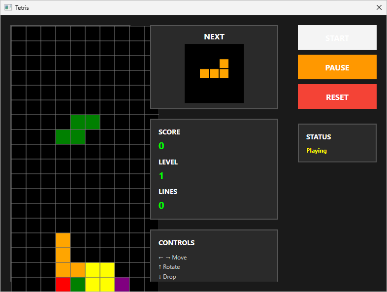
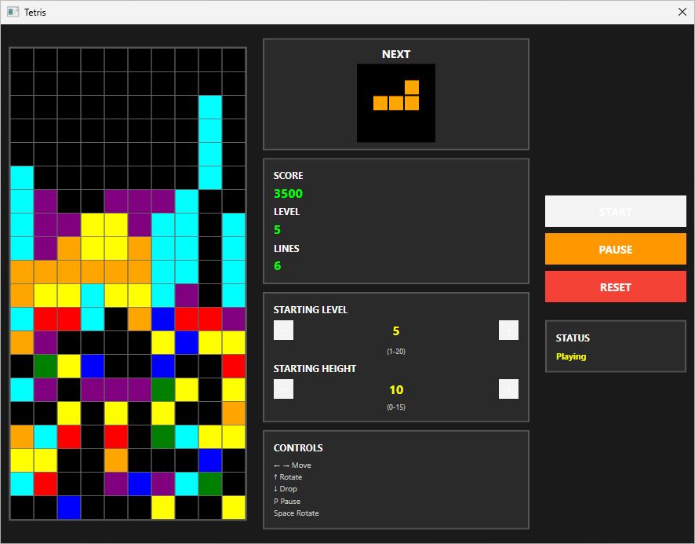
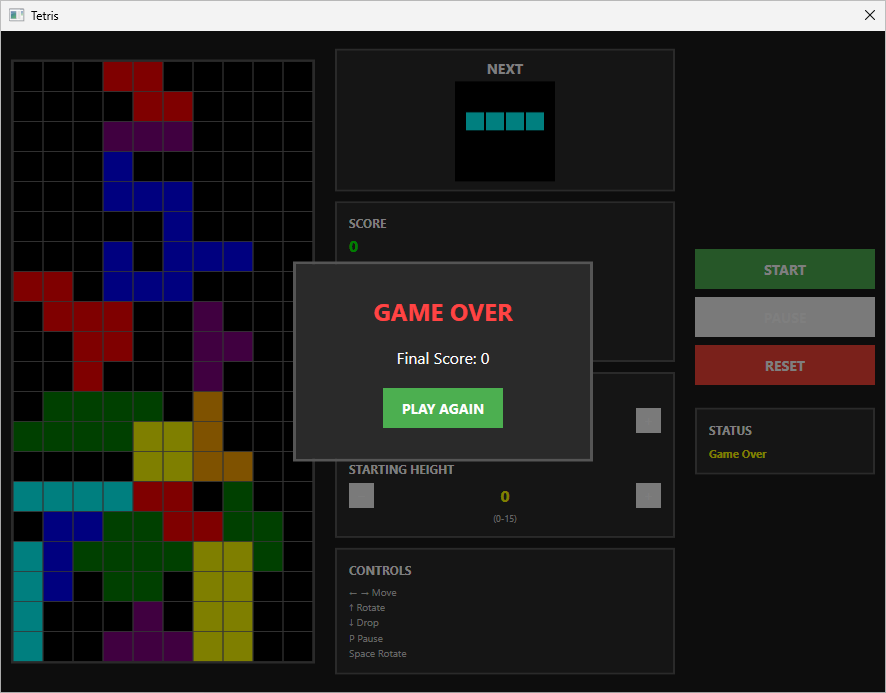
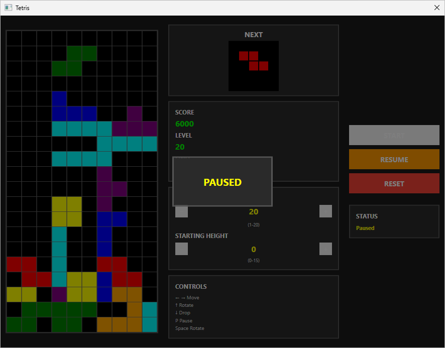

# Example

This example show how to create fully functional tetris game using so-called "vibe-coding" approach, not even a line of code will be added manually or even examined. All code, bugfixes and improvements will be made using `perpetual`. In this example we will be using Visual Studio, C#, .NET 8 and WPF/XAML technologies. For the LLM we will be using newest state-of-the art `claude-sonnet-4` (as for may 2025) and cheap `claude-3-haiku` (for non-coding tasks).

## Creating Visual Studio Solution

Create new desktop-application WPF/XAML solution for .NET 8 and C# in Visual Studio. Do not add any code or templates in it (if any). At the end you should end up with draft project similar to this:



## Initialize the **Perpetual** project

Open terminal with powershell session inside your project directory and initialize `perpetual` project in it.

```ps
Perpetual_amd64.exe init -l dotnetfw
```

## Prepare your .env files

Next, you need to create one or multiple `.env` files from provided `*.env.example` files and place it to apropriate config dir, see [this](../op_init.md) and [this](../configuration.md) docs for more info. In this example, the Anthropic provider is used with the `claude-sonnet-4-20250514` model for all operations.

Make sure your `.env` files (`.env` and/or `anthropic.env`) contains following lines:

```sh
LLM_PROVIDER="anthropic"
ANTHROPIC_MODEL_OP_ANNOTATE="claude-3-haiku-20240307"
ANTHROPIC_MODEL_OP_ANNOTATE_POST="claude-3-haiku-20240307"
ANTHROPIC_MODEL_OP_IMPLEMENT_STAGE1="claude-sonnet-4-20250514"
ANTHROPIC_MODEL_OP_IMPLEMENT_STAGE2="claude-sonnet-4-20250514"
ANTHROPIC_MODEL_OP_IMPLEMENT_STAGE3="claude-sonnet-4-20250514"
ANTHROPIC_MODEL_OP_IMPLEMENT_STAGE4="claude-sonnet-4-20250514"
ANTHROPIC_MODEL_OP_DOC_STAGE1="claude-sonnet-4-20250514"
ANTHROPIC_MODEL_OP_DOC_STAGE2="claude-sonnet-4-20250514"
ANTHROPIC_MODEL_OP_EXPLAIN_STAGE1="claude-sonnet-4-20250514"
ANTHROPIC_MODEL_OP_EXPLAIN_STAGE2="claude-sonnet-4-20250514"
ANTHROPIC_MODEL="claude-sonnet-4-20250514"
```

You, most probably, will need to alter some other parameters, see docs above for more info, also see example `.env` files: [.env.example](../../.perpetual/.env.example) and [anthropic.env.example](../../.perpetual/anthropic.env.example)

## Generate Requirements Specification Document

Next we will create some sort of requirements specification document, also with help of LLM. This document will be used to create initial implementation of the game. This step is **optional**, you can take example `task.md` (below), or you can write your own Requirements Specification by hand as PMs do.

To create initial `task.md` with Claude, in the terminal window inside project directory, type:

```ps
echo "I want to create a Tetris game. I need you to create a description of the task for implementing the game: game rules, settings, requirements, etc. The project will be written in .net 8, using wpf and xaml, a desktop application. Do not write any code now, just create me a document with the task." | Perpetual_amd64.exe explain -a -r .\task.md -р
```

You may alter the prompt if you want to. Non-determenistic nature of LLM will produce different results every time. You still will need to revise the `task.md` document - **remove the file-list** at the top of `task.md`, and make document more consise and easy to understand. This is crucial to make LLM to procude decent code.

In my case, after some editing, I end up with the following `task.md` document:
```markdown
Creating a Tetris Game in .NET Using WPF and XAML

---

### **1. Project Goal**

Develop a classic Tetris game as a desktop application using the .NET platform with WPF and XAML technologies. The game should be stable, user-friendly, and follow standard gaming mechanics.

---

### **2. Functional Requirements**

#### **Main Features:**

1. **Game Field (Grid):**

   - 10 columns × 20 rows.

   - Visualization as a grid (e.g., `Canvas` or `ItemsControl` with `DataTemplate`).

   - Display of current blocks and filled lines.

2. **Tetromino Shapes:**

   - 7 types of shapes (I, J, L, O, S, T, Z).

   - Each shape consists of 4 blocks.

   - Random selection of the next piece on each start.

3. **Controls:**

   - Move pieces with left/right arrow keys.

   - Rotate the piece using `Up` or `Space`.

   - Fast drop using `Down`.

   - Pause the game (`P` or "Pause" button).

4. **Falling Mechanic:**

   - The piece falls down every 500–1000 ms (speed depends on level).

   - Stops when it collides with other blocks or the bottom.

5. **Line Clearing:**

   - When a row is fully filled, it is removed.

6. **Score and Level:**

   - Score increases based on the number of cleared lines (1–4 rows).

   - Display current score and level.

   - Level increases after some amount of cleared lines.

7. **Game Over:**

   - The game ends if a piece cannot be placed at the top of the field.

8. **User Interface:**

   - Buttons for "Start", "Pause", "Reset".

   - Display of current score and level.

---

### **3. Technologies**

- Interface: WPF with XAML for visualization.

- Programming language: C#, .NET 8

---
```

Consider using provided `task.md` for this example.

## Generate Code

Now we can cenerate initial implementation by running following command in terminal:

```ps
Perpetual_amd64.exe implement -t -i .\task.md -pr
```

Example program output:

```ps
PS C:\Projects\Tetris> C:\Apps\Perpetual_6.1.0\Perpetual_amd64.exe implement -t -i .\task.md -pr
[00.000] [INF] Project root directory: C:\Projects\Tetris
[00.001] [INF] Loaded env file: C:\Users\User\AppData\Roaming\Perpetual\.env
[00.002] [INF] Loaded env file: C:\Users\User\AppData\Roaming\Perpetual\anthropic.env
[00.002] [INF] Loaded env file: C:\Users\User\AppData\Roaming\Perpetual\generic.env
[00.003] [INF] Loaded env file: C:\Users\User\AppData\Roaming\Perpetual\ollama.env
[00.004] [INF] Loaded env file: C:\Users\User\AppData\Roaming\Perpetual\openai.env
[00.005] [INF] Fetching project files
[00.007] [INF] Calculating checksums for project files
[00.008] [INF] Annotating files, count: 4
[00.008] [INF] [provider:anthropic] [model:claude-3-haiku-20240307] [segments:3] [retries:1] [temperature:0.5] [max tokens:768] [think:disabled] [variants:1] [strategy:SHORT] [format:plain]
[00.009] [INF] 1: App.xaml.cs
[03.427] [INF] 2: App.xaml
[06.171] [INF] 3: MainWindow.xaml
[09.592] [INF] 4: MainWindow.xaml.cs
[11.354] [INF] Saving annotations
[11.355] [INF] Embedding model is not configured or not available for selected LLM provider
[11.364] [INF] Running stage1: find project files for review
[11.364] [INF] [provider:anthropic] [model:claude-sonnet-4-20250514] [segments:3] [retries:3] [temperature:0.2] [max tokens:512] [think:disabled] [variants:1] [strategy:SHORT] [format:plain]
[16.840] [INF] Files requested by LLM:
[16.840] [INF] App.xaml
[16.840] [INF] App.xaml.cs
[16.840] [INF] MainWindow.xaml
[16.840] [INF] MainWindow.xaml.cs
[16.840] [INF] Attempting local similarity search
[16.840] [INF] LLM embeddings for local similarity search not configured or failed
[16.841] [INF] Running stage2: generating work plan
[16.841] [INF] [provider:anthropic] [model:claude-sonnet-4-20250514] [segments:3] [retries:3] [temperature:1] [max tokens:3584] [think tokens:2048] [variants:1] [strategy:SHORT] [format:plain]
[38.616] [INF] Running stage3: generating list of files for processing
[38.616] [INF] [provider:anthropic] [model:claude-sonnet-4-20250514] [segments:3] [retries:3] [temperature:0.2] [max tokens:512] [think:disabled] [variants:1] [strategy:SHORT] [format:plain]
[42.802] [INF] Files for processing selected by LLM:
[42.802] [INF] MainWindow.xaml
[42.802] [INF] MainWindow.xaml.cs
[42.803] [INF] TetrominoType.cs (new file)
[42.803] [INF] Tetromino.cs (new file)
[42.803] [INF] TetrominoShapes.cs (new file)
[42.803] [INF] GameBoard.cs (new file)
[42.803] [INF] GameState.cs (new file)
[42.803] [INF] GameEngine.cs (new file)
[42.803] [INF] Position.cs (new file)
[42.803] [INF] GameConstants.cs (new file)
[42.804] [INF] Running stage4: implementing code
[42.804] [INF] [provider:anthropic] [model:claude-sonnet-4-20250514] [segments:3] [retries:3] [temperature:0.1] [max tokens:32768] [think:disabled] [variants:1] [strategy:SHORT] [format:plain]
[42.804] [INF] MainWindow.xaml
[66.718] [INF] MainWindow.xaml.cs
[97.991] [INF] TetrominoType.cs
[103.503] [INF] Tetromino.cs
[122.194] [INF] TetrominoShapes.cs
[161.505] [INF] GameBoard.cs
[195.050] [INF] GameState.cs
[199.125] [INF] GameEngine.cs
[236.021] [INF] Position.cs
[264.580] [INF] GameConstants.cs
[297.148] [INF] Creating new stash from generated results
[297.149] [INF] Files backed up:
[297.149] [INF] MainWindow.xaml
[297.149] [INF] MainWindow.xaml.cs
[297.173] [INF] Processing stash: 2025-05-22_21-29-34
[297.197] [INF] Applying changes
[297.197] [INF] Tetromino.cs
[297.198] [INF] TetrominoShapes.cs
[297.199] [INF] GameState.cs
[297.200] [INF] GameEngine.cs
[297.201] [INF] TetrominoType.cs
[297.202] [INF] GameBoard.cs
[297.202] [INF] GameConstants.cs
[297.203] [INF] MainWindow.xaml
[297.204] [INF] Position.cs
[297.207] [INF] MainWindow.xaml.cs
```

Next, build and run the project with Visual Studio. In my case, there was no build errors (thanks to Claude 4), and the game looks like that:



Ok, we clearly see some UI problems here (and also, some other game bugs). Lets fix it, and also add some new features into the game

## Fixing the bugs and adding new features

To fix the bug, type following in your terminal window:

```ps
echo "This bug needs to be fixed: the game grid goes under the interface elements on the right, and vertically goes beyond the window. In addition, the frame with the control instructions is also slightly cut off at the bottom by the size of the window. Think of a better way to fix this bug and fix it." | Perpetual_amd64.exe implement -t
```

If after `perpetual` finished it's work and bug still not fixed, or fixes incorreclty, you may try to revert it's changes and re-run the task. in order to revert the changes, use your VCS or `perpetual` built-in stash operation (NOTE: it will not remove newly created files, only revert changed ones):

```ps
Perpetual_amd64.exe stash -r
```

In case of build errors, you can copy-paste text of error message and source it to the Perpetual input same as for fixing bugs.

### Fixing Remaining Bugs

Same way we can fix all the remaining bugs and problems (in your case there will be some other problems):

```ps
echo "Fix the following bug: Pause cannot be resumed by pressing P key" | Perpetual_amd64.exe implement -t
```

```ps
echo "Fix the following bug: When starting the game - no window controls should be selectable from the keyboard, such as pressing Tab to select a button to press, game keys should not select or interact with window controls." | Perpetual_amd64.exe implement -t
```

```ps
echo "Please add a control to select the starting level" | Perpetual_amd64.exe implement -t
```

```ps
echo "The sizes of the frames in the center of the window need to be corrected, currently it does not completely fit into the window vertically" | Perpetual_amd64.exe implement -t
```

### Implementing new features

Lets add a new feature to the game:

```ps
echo "Implement the following game feature: add a control to select the starting height, when starting height > 0, then all lines below this height should be randomly filled with blocks of different colors at the start of the game - from 1 to 7 cells in each line should remain empty. Pay attention to the sizes of the frames in the center of the window - all frames should fit into the game window vertically, place the control with the starting height inside the frame with the starting level" | Perpetual_amd64.exe implement -t
```

### Result





### Generated Files

Here are full listing of all generated source code files after all the fixes and adding starting-height feature. While working on this example nothing was edited or changed, all files presented as is

<details>
<summary>App.xaml</summary>

```xml
<Application x:Class="Tetris.App"
             xmlns="http://schemas.microsoft.com/winfx/2006/xaml/presentation"
             xmlns:x="http://schemas.microsoft.com/winfx/2006/xaml"
             xmlns:local="clr-namespace:Tetris"
             StartupUri="MainWindow.xaml">
    <Application.Resources>
         
    </Application.Resources>
</Application>
```

</details>

<details>
<summary>App.xaml.cs</summary>

```cs
using System.Configuration;
using System.Data;
using System.Windows;

namespace Tetris
{
    /// <summary>
    /// Interaction logic for App.xaml
    /// </summary>
    public partial class App : Application
    {
    }

}
```

</details>

<details>
<summary>AssemblyInfo.cs</summary>

```cs
using System.Windows;

[assembly: ThemeInfo(
    ResourceDictionaryLocation.None,            //where theme specific resource dictionaries are located
                                                //(used if a resource is not found in the page,
                                                // or application resource dictionaries)
    ResourceDictionaryLocation.SourceAssembly   //where the generic resource dictionary is located
                                                //(used if a resource is not found in the page,
                                                // app, or any theme specific resource dictionaries)
)]
```

</details>

<details>
<summary>GameBoard.cs</summary>

```cs
namespace Tetris
{
    /// <summary>
    /// Represents the game board for Tetris, managing the grid state and piece placement
    /// </summary>
    public class GameBoard
    {
        private readonly TetrominoType[,] board;
        private readonly int width;
        private readonly int height;

        /// <summary>
        /// Gets the width of the game board
        /// </summary>
        public int Width => width;

        /// <summary>
        /// Gets the height of the game board
        /// </summary>
        public int Height => height;

        /// <summary>
        /// Initializes a new game board with the specified dimensions
        /// </summary>
        /// <param name="width">The width of the board in blocks</param>
        /// <param name="height">The height of the board in blocks</param>
        public GameBoard(int width, int height)
        {
            this.width = width;
            this.height = height;
            board = new TetrominoType[height, width];
            Clear();
        }

        /// <summary>
        /// Clears the entire game board
        /// </summary>
        public void Clear()
        {
            for (int row = 0; row < height; row++)
            {
                for (int col = 0; col < width; col++)
                {
                    board[row, col] = TetrominoType.None;
                }
            }
        }

        /// <summary>
        /// Gets the Tetromino type at the specified position
        /// </summary>
        /// <param name="row">The row position</param>
        /// <param name="col">The column position</param>
        /// <returns>The Tetromino type at the position</returns>
        public TetrominoType GetCell(int row, int col)
        {
            if (IsValidPosition(row, col))
            {
                return board[row, col];
            }
            return TetrominoType.None;
        }

        /// <summary>
        /// Sets the Tetromino type at the specified position
        /// </summary>
        /// <param name="row">The row position</param>
        /// <param name="col">The column position</param>
        /// <param name="type">The Tetromino type to set</param>
        public void SetCell(int row, int col, TetrominoType type)
        {
            if (IsValidPosition(row, col))
            {
                board[row, col] = type;
            }
        }

        /// <summary>
        /// Checks if the specified position is within the board boundaries
        /// </summary>
        /// <param name="row">The row position</param>
        /// <param name="col">The column position</param>
        /// <returns>True if the position is valid</returns>
        public bool IsValidPosition(int row, int col)
        {
            return row >= 0 && row < height && col >= 0 && col < width;
        }

        /// <summary>
        /// Checks if the specified position is empty (contains no piece)
        /// </summary>
        /// <param name="row">The row position</param>
        /// <param name="col">The column position</param>
        /// <returns>True if the position is empty</returns>
        public bool IsEmpty(int row, int col)
        {
            return IsValidPosition(row, col) && board[row, col] == TetrominoType.None;
        }

        /// <summary>
        /// Checks if the specified position is occupied by a piece
        /// </summary>
        /// <param name="row">The row position</param>
        /// <param name="col">The column position</param>
        /// <returns>True if the position is occupied</returns>
        public bool IsOccupied(int row, int col)
        {
            return IsValidPosition(row, col) && board[row, col] != TetrominoType.None;
        }

        /// <summary>
        /// Checks if a Tetromino can be placed at the specified position
        /// </summary>
        /// <param name="tetromino">The Tetromino to check</param>
        /// <returns>True if the Tetromino can be placed</returns>
        public bool CanPlaceTetromino(Tetromino tetromino)
        {
            var occupiedPositions = tetromino.GetOccupiedPositions();
            
            foreach (var position in occupiedPositions)
            {
                // Check if position is within bounds
                if (!IsValidPosition(position.Row, position.Col))
                {
                    return false;
                }
                
                // Check if position is already occupied
                if (IsOccupied(position.Row, position.Col))
                {
                    return false;
                }
            }
            
            return true;
        }

        /// <summary>
        /// Places a Tetromino on the board at its current position
        /// </summary>
        /// <param name="tetromino">The Tetromino to place</param>
        /// <returns>True if the Tetromino was successfully placed</returns>
        public bool PlaceTetromino(Tetromino tetromino)
        {
            if (!CanPlaceTetromino(tetromino))
            {
                return false;
            }
            
            var occupiedPositions = tetromino.GetOccupiedPositions();
            
            foreach (var position in occupiedPositions)
            {
                SetCell(position.Row, position.Col, tetromino.Type);
            }
            
            return true;
        }

        /// <summary>
        /// Checks if the specified row is completely filled
        /// </summary>
        /// <param name="row">The row to check</param>
        /// <returns>True if the row is completely filled</returns>
        public bool IsRowFull(int row)
        {
            if (row < 0 || row >= height)
            {
                return false;
            }
            
            for (int col = 0; col < width; col++)
            {
                if (board[row, col] == TetrominoType.None)
                {
                    return false;
                }
            }
            
            return true;
        }

        /// <summary>
        /// Checks if the specified row is completely empty
        /// </summary>
        /// <param name="row">The row to check</param>
        /// <returns>True if the row is completely empty</returns>
        public bool IsRowEmpty(int row)
        {
            if (row < 0 || row >= height)
            {
                return false;
            }
            
            for (int col = 0; col < width; col++)
            {
                if (board[row, col] != TetrominoType.None)
                {
                    return false;
                }
            }
            
            return true;
        }

        /// <summary>
        /// Gets all rows that are completely filled
        /// </summary>
        /// <returns>A list of row indices that are full</returns>
        public List<int> GetFullRows()
        {
            var fullRows = new List<int>();
            
            for (int row = 0; row < height; row++)
            {
                if (IsRowFull(row))
                {
                    fullRows.Add(row);
                }
            }
            
            return fullRows;
        }

        /// <summary>
        /// Clears the specified row by setting all cells to None
        /// </summary>
        /// <param name="row">The row to clear</param>
        public void ClearRow(int row)
        {
            if (row >= 0 && row < height)
            {
                for (int col = 0; col < width; col++)
                {
                    board[row, col] = TetrominoType.None;
                }
            }
        }

        /// <summary>
        /// Moves all rows above the specified row down by one position
        /// </summary>
        /// <param name="clearedRow">The row that was cleared</param>
        public void DropRowsAbove(int clearedRow)
        {
            for (int row = clearedRow; row > 0; row--)
            {
                for (int col = 0; col < width; col++)
                {
                    board[row, col] = board[row - 1, col];
                }
            }
            
            // Clear the top row
            ClearRow(0);
        }

        /// <summary>
        /// Clears all full rows and drops the rows above them
        /// </summary>
        /// <returns>The number of rows that were cleared</returns>
        public int ClearFullRows()
        {
            var fullRows = GetFullRows();
            int clearedCount = fullRows.Count;
            
            if (clearedCount == 0)
            {
                return 0;
            }

            // Create a new board to rebuild without the full rows
            var newBoard = new TetrominoType[height, width];
            
            // Initialize new board with empty cells
            for (int row = 0; row < height; row++)
            {
                for (int col = 0; col < width; col++)
                {
                    newBoard[row, col] = TetrominoType.None;
                }
            }
            
            // Copy non-full rows to the new board, starting from the bottom
            int newBoardRow = height - 1;
            
            for (int oldRow = height - 1; oldRow >= 0; oldRow--)
            {
                if (!fullRows.Contains(oldRow))
                {
                    // This row is not full, copy it to the new board
                    for (int col = 0; col < width; col++)
                    {
                        newBoard[newBoardRow, col] = board[oldRow, col];
                    }
                    newBoardRow--;
                }
            }
            
            // Replace the old board with the new board
            for (int row = 0; row < height; row++)
            {
                for (int col = 0; col < width; col++)
                {
                    board[row, col] = newBoard[row, col];
                }
            }
            
            return clearedCount;
        }

        /// <summary>
        /// Gets a copy of the current board state
        /// </summary>
        /// <returns>A 2D array representing the current board state</returns>
        public TetrominoType[,] GetBoardState()
        {
            var boardCopy = new TetrominoType[height, width];
            
            for (int row = 0; row < height; row++)
            {
                for (int col = 0; col < width; col++)
                {
                    boardCopy[row, col] = board[row, col];
                }
            }
            
            return boardCopy;
        }

        /// <summary>
        /// Checks if the game is over (top row has any occupied cells)
        /// </summary>
        /// <returns>True if the game is over</returns>
        public bool IsGameOver()
        {
            // Check if any cell in the top row is occupied
            for (int col = 0; col < width; col++)
            {
                if (board[0, col] != TetrominoType.None)
                {
                    return true;
                }
            }
            
            return false;
        }

        /// <summary>
        /// Gets the height of the highest occupied cell in the specified column
        /// </summary>
        /// <param name="col">The column to check</param>
        /// <returns>The height from the bottom (0 = empty column, height = full column)</returns>
        public int GetColumnHeight(int col)
        {
            if (col < 0 || col >= width)
            {
                return 0;
            }
            
            for (int row = 0; row < height; row++)
            {
                if (board[row, col] != TetrominoType.None)
                {
                    return height - row;
                }
            }
            
            return 0;
        }

        /// <summary>
        /// Gets the total number of occupied cells on the board
        /// </summary>
        /// <returns>The number of occupied cells</returns>
        public int GetOccupiedCellCount()
        {
            int count = 0;
            
            for (int row = 0; row < height; row++)
            {
                for (int col = 0; col < width; col++)
                {
                    if (board[row, col] != TetrominoType.None)
                    {
                        count++;
                    }
                }
            }
            
            return count;
        }

        /// <summary>
        /// Creates a string representation of the board for debugging
        /// </summary>
        /// <returns>A string representation of the board</returns>
        public override string ToString()
        {
            var sb = new System.Text.StringBuilder();
            
            for (int row = 0; row < height; row++)
            {
                for (int col = 0; col < width; col++)
                {
                    char symbol = board[row, col] == TetrominoType.None ? '.' : '#';
                    sb.Append(symbol);
                }
                sb.AppendLine();
            }
            
            return sb.ToString();
        }
    }
}
```

</details>

<details>
<summary>GameConstants.cs</summary>

```cs
namespace Tetris
{
    /// <summary>
    /// Static class containing all game constants and configuration values for Tetris
    /// </summary>
    public static class GameConstants
    {
        #region Board Dimensions
        /// <summary>
        /// The width of the game board in blocks
        /// </summary>
        public const int BoardWidth = 10;

        /// <summary>
        /// The height of the game board in blocks
        /// </summary>
        public const int BoardHeight = 20;
        #endregion

        #region Game Speed and Timing
        /// <summary>
        /// Base fall speed in milliseconds (starting speed at level 1)
        /// </summary>
        public const int BaseFallSpeed = 1000;

        /// <summary>
        /// Minimum fall speed in milliseconds (fastest possible speed)
        /// </summary>
        public const int MinFallSpeed = 50;

        /// <summary>
        /// Speed increase per level in milliseconds (how much faster each level gets)
        /// </summary>
        public const int SpeedIncreasePerLevel = 50;

        /// <summary>
        /// Fast drop speed multiplier (how much faster pieces fall when down arrow is held)
        /// </summary>
        public const double FastDropMultiplier = 0.1;
        #endregion

        #region Scoring System
        /// <summary>
        /// Base score for clearing a single line
        /// </summary>
        public const int SingleLineScore = 100;

        /// <summary>
        /// Base score for clearing two lines simultaneously
        /// </summary>
        public const int DoubleLineScore = 300;

        /// <summary>
        /// Base score for clearing three lines simultaneously
        /// </summary>
        public const int TripleLineScore = 500;

        /// <summary>
        /// Base score for clearing four lines simultaneously (Tetris)
        /// </summary>
        public const int TetrisScore = 800;

        /// <summary>
        /// Bonus points for hard dropping a piece (per row dropped)
        /// </summary>
        public const int HardDropBonus = 2;

        /// <summary>
        /// Bonus points for soft dropping a piece (per row dropped)
        /// </summary>
        public const int SoftDropBonus = 1;
        #endregion

        #region Level Progression
        /// <summary>
        /// Number of lines that must be cleared to advance to the next level
        /// </summary>
        public const int LinesPerLevel = 10;

        /// <summary>
        /// Maximum level that can be reached
        /// </summary>
        public const int MaxLevel = 20;

        /// <summary>
        /// Starting level for new games
        /// </summary>
        public const int StartingLevel = 1;
        #endregion

        #region Starting Height Settings
        /// <summary>
        /// Minimum starting height (no pre-filled rows)
        /// </summary>
        public const int MinStartingHeight = 0;

        /// <summary>
        /// Maximum starting height (maximum number of rows to pre-fill)
        /// </summary>
        public const int MaxStartingHeight = 15;

        /// <summary>
        /// Minimum number of empty cells per row when filling starting height
        /// </summary>
        public const int MinEmptyCellsPerRow = 1;

        /// <summary>
        /// Maximum number of empty cells per row when filling starting height
        /// </summary>
        public const int MaxEmptyCellsPerRow = 7;
        #endregion

        #region Piece Spawn Settings
        /// <summary>
        /// Default spawn row for most Tetromino pieces
        /// </summary>
        public const int DefaultSpawnRow = 0;

        /// <summary>
        /// Spawn row for I-piece (starts slightly above the board)
        /// </summary>
        public const int IPieceSpawnRow = -1;

        /// <summary>
        /// Number of preview pieces to show (currently only next piece is shown)
        /// </summary>
        public const int PreviewPieceCount = 1;
        #endregion

        #region Visual Settings
        /// <summary>
        /// Size of each block in pixels for the main game board
        /// </summary>
        public const int BlockSize = 30;

        /// <summary>
        /// Size of each block in pixels for the preview area
        /// </summary>
        public const int PreviewBlockSize = 20;

        /// <summary>
        /// Thickness of the grid lines in pixels
        /// </summary>
        public const double GridLineThickness = 0.5;

        /// <summary>
        /// Thickness of piece borders in pixels
        /// </summary>
        public const double PieceBorderThickness = 1.0;
        #endregion

        #region Game Mechanics
        /// <summary>
        /// Number of rotation states for each piece (0, 90, 180, 270 degrees)
        /// </summary>
        public const int RotationStates = 4;

        /// <summary>
        /// Maximum number of wall kick attempts when rotating
        /// </summary>
        public const int MaxWallKickAttempts = 2;

        /// <summary>
        /// Delay in milliseconds before a piece locks in place after landing
        /// </summary>
        public const int LockDelay = 500;

        /// <summary>
        /// Number of times a piece can be moved/rotated before lock delay resets
        /// </summary>
        public const int MaxLockDelayResets = 15;
        #endregion

        #region Input Settings
        /// <summary>
        /// Delay in milliseconds before auto-repeat starts when holding a key
        /// </summary>
        public const int AutoRepeatDelay = 300;

        /// <summary>
        /// Rate in milliseconds for auto-repeat when holding a key
        /// </summary>
        public const int AutoRepeatRate = 50;
        #endregion

        #region Animation Settings
        /// <summary>
        /// Duration in milliseconds for line clear animation
        /// </summary>
        public const int LineClearAnimationDuration = 300;

        /// <summary>
        /// Duration in milliseconds for piece placement flash
        /// </summary>
        public const int PlacementFlashDuration = 100;

        /// <summary>
        /// Duration in milliseconds for game over animation
        /// </summary>
        public const int GameOverAnimationDuration = 1000;
        #endregion

        #region File and Save Settings
        /// <summary>
        /// Default high score file name
        /// </summary>
        public const string HighScoreFileName = "highscores.dat";

        /// <summary>
        /// Default settings file name
        /// </summary>
        public const string SettingsFileName = "settings.json";

        /// <summary>
        /// Maximum number of high scores to store
        /// </summary>
        public const int MaxHighScores = 10;
        #endregion

        #region Debug Settings
        /// <summary>
        /// Whether to show debug information
        /// </summary>
        public const bool ShowDebugInfo = false;

        /// <summary>
        /// Whether to enable ghost piece (preview of where piece will land)
        /// </summary>
        public const bool EnableGhostPiece = true;

        /// <summary>
        /// Whether to show grid lines on the game board
        /// </summary>
        public const bool ShowGridLines = true;
        #endregion

        #region Color Settings (as string constants for XAML binding)
        /// <summary>
        /// Background color for the game board
        /// </summary>
        public const string BoardBackgroundColor = "#000000";

        /// <summary>
        /// Color for grid lines
        /// </summary>
        public const string GridLineColor = "#808080";

        /// <summary>
        /// Background color for UI panels
        /// </summary>
        public const string PanelBackgroundColor = "#2a2a2a";

        /// <summary>
        /// Border color for UI panels
        /// </summary>
        public const string PanelBorderColor = "#555555";
        #endregion

        #region Validation Methods
        /// <summary>
        /// Validates if a position is within the game board bounds
        /// </summary>
        /// <param name="row">The row to validate</param>
        /// <param name="col">The column to validate</param>
        /// <returns>True if the position is valid</returns>
        public static bool IsValidBoardPosition(int row, int col)
        {
            return row >= 0 && row < BoardHeight && col >= 0 && col < BoardWidth;
        }

        /// <summary>
        /// Validates if a level is within the valid range
        /// </summary>
        /// <param name="level">The level to validate</param>
        /// <returns>True if the level is valid</returns>
        public static bool IsValidLevel(int level)
        {
            return level >= StartingLevel && level <= MaxLevel;
        }

        /// <summary>
        /// Validates if a starting height is within the valid range
        /// </summary>
        /// <param name="height">The starting height to validate</param>
        /// <returns>True if the starting height is valid</returns>
        public static bool IsValidStartingHeight(int height)
        {
            return height >= MinStartingHeight && height <= MaxStartingHeight;
        }

        /// <summary>
        /// Validates if a rotation state is valid
        /// </summary>
        /// <param name="rotation">The rotation state to validate</param>
        /// <returns>True if the rotation is valid</returns>
        public static bool IsValidRotation(int rotation)
        {
            return rotation >= 0 && rotation < RotationStates;
        }
        #endregion

        #region Calculation Helpers
        /// <summary>
        /// Calculates the fall speed for a given level
        /// </summary>
        /// <param name="level">The current level</param>
        /// <returns>Fall speed in milliseconds</returns>
        public static int CalculateFallSpeed(int level)
        {
            if (level < StartingLevel) level = StartingLevel;
            if (level > MaxLevel) level = MaxLevel;

            int speed = BaseFallSpeed - ((level - 1) * SpeedIncreasePerLevel);
            return Math.Max(speed, MinFallSpeed);
        }

        /// <summary>
        /// Calculates the score multiplier for a given level
        /// </summary>
        /// <param name="level">The current level</param>
        /// <returns>Score multiplier</returns>
        public static int CalculateScoreMultiplier(int level)
        {
            return Math.Max(level, 1);
        }

        /// <summary>
        /// Calculates the required lines to reach the next level
        /// </summary>
        /// <param name="currentLevel">The current level</param>
        /// <param name="totalLinesCleared">Total lines cleared so far</param>
        /// <returns>Lines needed for next level</returns>
        public static int CalculateLinesForNextLevel(int currentLevel, int totalLinesCleared)
        {
            int targetLines = currentLevel * LinesPerLevel;
            return Math.Max(0, targetLines - totalLinesCleared);
        }
        #endregion
    }
}
```

</details>

<details>
<summary>GameEngine.cs</summary>

```cs
namespace Tetris
{
    /// <summary>
    /// Main game engine that manages the overall game logic, state, and mechanics
    /// </summary>
    public class GameEngine
    {
        private readonly GameBoard gameBoard;
        private readonly Random random;
        private Tetromino? currentPiece;
        private TetrominoType nextPiece;
        private GameState currentState;
        private int score;
        private int level;
        private int linesCleared;
        private int totalLinesCleared;
        private int startingLevel;

        /// <summary>
        /// Event fired when the game state changes
        /// </summary>
        public event Action<GameState>? GameStateChanged;

        /// <summary>
        /// Event fired when the score, level, or lines cleared changes
        /// </summary>
        public event Action? ScoreChanged;

        /// <summary>
        /// Event fired when the board state changes
        /// </summary>
        public event Action? BoardChanged;

        /// <summary>
        /// Gets the current game state
        /// </summary>
        public GameState CurrentState => currentState;

        /// <summary>
        /// Gets the current score
        /// </summary>
        public int Score => score;

        /// <summary>
        /// Gets the current level
        /// </summary>
        public int Level => level;

        /// <summary>
        /// Gets the number of lines cleared in the current game
        /// </summary>
        public int LinesCleared => totalLinesCleared;

        /// <summary>
        /// Gets the current falling piece
        /// </summary>
        public Tetromino? CurrentPiece => currentPiece;

        /// <summary>
        /// Gets the next piece type
        /// </summary>
        public TetrominoType NextPiece => nextPiece;

        /// <summary>
        /// Initializes a new game engine
        /// </summary>
        public GameEngine()
        {
            gameBoard = new GameBoard(GameConstants.BoardWidth, GameConstants.BoardHeight);
            random = new Random();
            currentState = GameState.NotStarted;
            Reset();
        }

        /// <summary>
        /// Starts a new game
        /// </summary>
        public void StartNewGame()
        {
            StartNewGame(GameConstants.StartingLevel, GameConstants.MinStartingHeight);
        }

        /// <summary>
        /// Starts a new game with the specified starting level
        /// </summary>
        /// <param name="startingLevel">The level to start the game at</param>
        public void StartNewGame(int startingLevel)
        {
            StartNewGame(startingLevel, GameConstants.MinStartingHeight);
        }

        /// <summary>
        /// Starts a new game with the specified starting level and height
        /// </summary>
        /// <param name="startingLevel">The level to start the game at</param>
        /// <param name="startingHeight">The height to fill with random blocks</param>
        public void StartNewGame(int startingLevel, int startingHeight)
        {
            Reset();
            
            // Validate and set the starting level
            if (GameConstants.IsValidLevel(startingLevel))
            {
                level = startingLevel;
                this.startingLevel = startingLevel;
            }
            else
            {
                level = GameConstants.StartingLevel;
                this.startingLevel = GameConstants.StartingLevel;
            }

            // Validate and apply starting height
            if (GameConstants.IsValidStartingHeight(startingHeight))
            {
                FillRandomBlocks(startingHeight);
            }
            
            currentState = GameState.Playing;
            SpawnNewPiece();
            GameStateChanged?.Invoke(currentState);
            ScoreChanged?.Invoke(); // Fire this to update the level display
            BoardChanged?.Invoke();
        }

        /// <summary>
        /// Fills the bottom rows with random blocks based on starting height
        /// </summary>
        /// <param name="height">Number of rows to fill from the bottom</param>
        private void FillRandomBlocks(int height)
        {
            if (height <= 0) return;

            // Get all tetromino types except None
            var tetrominoTypes = new[] { TetrominoType.I, TetrominoType.J, TetrominoType.L, 
                                       TetrominoType.O, TetrominoType.S, TetrominoType.T, TetrominoType.Z };

            for (int row = GameConstants.BoardHeight - height; row < GameConstants.BoardHeight; row++)
            {
                // Determine how many empty cells to leave (1-7)
                int emptyCells = random.Next(1, 8);
                
                // Create a list of column indices
                var columns = new List<int>();
                for (int col = 0; col < GameConstants.BoardWidth; col++)
                {
                    columns.Add(col);
                }

                // Randomly select which columns to leave empty
                var emptyColumns = new HashSet<int>();
                for (int i = 0; i < emptyCells && columns.Count > 0; i++)
                {
                    int randomIndex = random.Next(columns.Count);
                    emptyColumns.Add(columns[randomIndex]);
                    columns.RemoveAt(randomIndex);
                }

                // Fill the remaining columns with random tetromino types
                for (int col = 0; col < GameConstants.BoardWidth; col++)
                {
                    if (!emptyColumns.Contains(col))
                    {
                        var randomType = tetrominoTypes[random.Next(tetrominoTypes.Length)];
                        gameBoard.SetCell(row, col, randomType);
                    }
                }
            }
        }

        /// <summary>
        /// Resets the game to initial state
        /// </summary>
        public void Reset()
        {
            gameBoard.Clear();
            currentPiece = null;
            nextPiece = TetrominoShapes.GetRandomType(random);
            score = 0;
            level = GameConstants.StartingLevel;
            startingLevel = GameConstants.StartingLevel;
            linesCleared = 0;
            totalLinesCleared = 0;
            currentState = GameState.NotStarted;
            
            ScoreChanged?.Invoke();
            BoardChanged?.Invoke();
        }

        /// <summary>
        /// Pauses the game
        /// </summary>
        public void Pause()
        {
            if (currentState == GameState.Playing)
            {
                currentState = GameState.Paused;
                GameStateChanged?.Invoke(currentState);
            }
        }

        /// <summary>
        /// Resumes the game from pause
        /// </summary>
        public void Resume()
        {
            if (currentState == GameState.Paused)
            {
                currentState = GameState.Playing;
                GameStateChanged?.Invoke(currentState);
            }
        }

        /// <summary>
        /// Main game tick - handles automatic piece falling
        /// </summary>
        public void Tick()
        {
            if (currentState != GameState.Playing || currentPiece == null)
                return;

            // Try to move the current piece down
            if (!MovePiece(0, 1))
            {
                // Piece can't move down, so place it and spawn a new one
                PlaceCurrentPiece();
                ClearFullRows();
                
                if (CheckGameOver())
                {
                    currentState = GameState.GameOver;
                    GameStateChanged?.Invoke(currentState);
                    return;
                }
                
                SpawnNewPiece();
            }
            
            BoardChanged?.Invoke();
        }

        /// <summary>
        /// Attempts to move the current piece by the specified offset
        /// </summary>
        /// <param name="deltaCol">Horizontal movement (positive = right, negative = left)</param>
        /// <param name="deltaRow">Vertical movement (positive = down, negative = up)</param>
        /// <returns>True if the piece was moved successfully</returns>
        public bool MovePiece(int deltaCol, int deltaRow)
        {
            if (currentState != GameState.Playing || currentPiece == null)
                return false;

            var newPosition = new Position(
                currentPiece.Position.Row + deltaRow,
                currentPiece.Position.Col + deltaCol
            );

            var testPiece = currentPiece.CloneAt(newPosition);
            
            if (gameBoard.CanPlaceTetromino(testPiece))
            {
                currentPiece.Move(deltaCol, deltaRow);
                BoardChanged?.Invoke();
                return true;
            }

            return false;
        }

        /// <summary>
        /// Attempts to rotate the current piece clockwise
        /// </summary>
        /// <returns>True if the piece was rotated successfully</returns>
        public bool RotatePiece()
        {
            if (currentState != GameState.Playing || currentPiece == null)
                return false;

            var testPiece = currentPiece.CloneWithRotation((currentPiece.Rotation + 1) % 4);
            
            if (gameBoard.CanPlaceTetromino(testPiece))
            {
                currentPiece.Rotate();
                BoardChanged?.Invoke();
                return true;
            }

            // Try wall kicks - simple implementation
            // Try moving left and right to see if rotation is possible
            for (int offset = 1; offset <= 2; offset++)
            {
                // Try moving right
                var rightTestPiece = testPiece.CloneAt(new Position(
                    testPiece.Position.Row,
                    testPiece.Position.Col + offset
                ));
                
                if (gameBoard.CanPlaceTetromino(rightTestPiece))
                {
                    currentPiece.Rotate();
                    currentPiece.Move(offset, 0);
                    BoardChanged?.Invoke();
                    return true;
                }

                // Try moving left
                var leftTestPiece = testPiece.CloneAt(new Position(
                    testPiece.Position.Row,
                    testPiece.Position.Col - offset
                ));
                
                if (gameBoard.CanPlaceTetromino(leftTestPiece))
                {
                    currentPiece.Rotate();
                    currentPiece.Move(-offset, 0);
                    BoardChanged?.Invoke();
                    return true;
                }
            }

            return false;
        }

        /// <summary>
        /// Drops the current piece as far down as possible
        /// </summary>
        public void HardDrop()
        {
            if (currentState != GameState.Playing || currentPiece == null)
                return;

            while (MovePiece(0, 1))
            {
                // Keep moving down until it can't move anymore
            }

            // The piece will be placed on the next tick
        }

        /// <summary>
        /// Spawns a new piece at the top of the board
        /// </summary>
        private void SpawnNewPiece()
        {
            var spawnPosition = TetrominoShapes.GetSpawnPosition(nextPiece);
            currentPiece = new Tetromino(nextPiece, spawnPosition);
            nextPiece = TetrominoShapes.GetRandomType(random);

            // Check if the new piece can be placed
            if (!gameBoard.CanPlaceTetromino(currentPiece))
            {
                currentState = GameState.GameOver;
                GameStateChanged?.Invoke(currentState);
            }
        }

        /// <summary>
        /// Places the current piece on the board
        /// </summary>
        private void PlaceCurrentPiece()
        {
            if (currentPiece != null)
            {
                gameBoard.PlaceTetromino(currentPiece);
                currentPiece = null;
            }
        }

        /// <summary>
        /// Clears all full rows and updates the score
        /// </summary>
        private void ClearFullRows()
        {
            int rowsCleared = gameBoard.ClearFullRows();
            
            if (rowsCleared > 0)
            {
                totalLinesCleared += rowsCleared;
                UpdateScore(rowsCleared);
                UpdateLevel();
                ScoreChanged?.Invoke();
            }
        }

        /// <summary>
        /// Updates the score based on the number of rows cleared
        /// </summary>
        /// <param name="rowsCleared">Number of rows cleared simultaneously</param>
        private void UpdateScore(int rowsCleared)
        {
            // Scoring system based on classic Tetris
            int baseScore = rowsCleared switch
            {
                1 => 100,   // Single
                2 => 300,   // Double
                3 => 500,   // Triple
                4 => 800,   // Tetris
                _ => 0
            };

            score += baseScore * level;
        }

        /// <summary>
        /// Updates the level based on lines cleared
        /// </summary>
        private void UpdateLevel()
        {
            // Level increases every 10 lines cleared, but never goes below the starting level
            int newLevel = startingLevel + (totalLinesCleared / GameConstants.LinesPerLevel);
            
            if (newLevel > level)
            {
                level = Math.Min(newLevel, GameConstants.MaxLevel);
            }
        }

        /// <summary>
        /// Checks if the game is over
        /// </summary>
        /// <returns>True if the game is over</returns>
        private bool CheckGameOver()
        {
            return gameBoard.IsGameOver();
        }

        /// <summary>
        /// Gets the current fall speed in milliseconds based on the level
        /// </summary>
        /// <returns>Fall speed in milliseconds</returns>
        public int GetFallSpeed()
        {
            return GameConstants.CalculateFallSpeed(level);
        }

        /// <summary>
        /// Gets a copy of the current board state
        /// </summary>
        /// <returns>A 2D array representing the board state</returns>
        public TetrominoType[,] GetBoardState()
        {
            return gameBoard.GetBoardState();
        }

        /// <summary>
        /// Gets the current game statistics
        /// </summary>
        /// <returns>A tuple containing score, level, and lines cleared</returns>
        public (int Score, int Level, int LinesCleared) GetGameStats()
        {
            return (score, level, totalLinesCleared);
        }

        /// <summary>
        /// Checks if the game is currently active (playing or paused)
        /// </summary>
        /// <returns>True if the game is active</returns>
        public bool IsGameActive()
        {
            return currentState == GameState.Playing || currentState == GameState.Paused;
        }

        /// <summary>
        /// Gets the number of occupied cells on the board
        /// </summary>
        /// <returns>Number of occupied cells</returns>
        public int GetOccupiedCellCount()
        {
            return gameBoard.GetOccupiedCellCount();
        }

        /// <summary>
        /// Gets the height of the highest column on the board
        /// </summary>
        /// <returns>The maximum column height</returns>
        public int GetMaxColumnHeight()
        {
            int maxHeight = 0;
            
            for (int col = 0; col < GameConstants.BoardWidth; col++)
            {
                int height = gameBoard.GetColumnHeight(col);
                maxHeight = Math.Max(maxHeight, height);
            }
            
            return maxHeight;
        }
    }
}
```

</details>

<details>
<summary>GameState.cs</summary>

```cs
namespace Tetris
{
    /// <summary>
    /// Enumeration representing the different states of the Tetris game
    /// </summary>
    public enum GameState
    {
        /// <summary>
        /// Game has not been started yet
        /// </summary>
        NotStarted,
        
        /// <summary>
        /// Game is currently being played
        /// </summary>
        Playing,
        
        /// <summary>
        /// Game is paused
        /// </summary>
        Paused,
        
        /// <summary>
        /// Game has ended (game over condition reached)
        /// </summary>
        GameOver
    }
}
```

</details>

<details>
<summary>MainWindow.xaml</summary>

```xml
<Window x:Class="Tetris.MainWindow"
        xmlns="http://schemas.microsoft.com/winfx/2006/xaml/presentation"
        xmlns:x="http://schemas.microsoft.com/winfx/2006/xaml"
        xmlns:d="http://schemas.microsoft.com/expression/blend/2008"
        xmlns:mc="http://schemas.openxmlformats.org/markup-compatibility/2006"
        xmlns:local="clr-namespace:Tetris"
        mc:Ignorable="d"
        Title="Tetris" Height="700" Width="900"
        KeyDown="Window_KeyDown"
        Focusable="True"
        ResizeMode="NoResize"
        WindowStartupLocation="CenterScreen">
    <Grid Background="#1a1a1a">
        <Grid.ColumnDefinitions>
            <ColumnDefinition Width="Auto"/>
            <ColumnDefinition Width="*"/>
            <ColumnDefinition Width="200"/>
        </Grid.ColumnDefinitions>
        
        <!-- Game Field -->
        <Border Grid.Column="0" Background="#2a2a2a" BorderBrush="#555" BorderThickness="2" Margin="10" VerticalAlignment="Center">
            <Canvas x:Name="GameCanvas" Width="300" Height="600" Background="#000"/>
        </Border>
        
        <!-- Side Panel -->
        <ScrollViewer Grid.Column="1" VerticalScrollBarVisibility="Auto" HorizontalScrollBarVisibility="Disabled" Margin="10" Focusable="False">
            <StackPanel VerticalAlignment="Center">
                <!-- Next Piece Preview -->
                <Border Background="#2a2a2a" BorderBrush="#555" BorderThickness="2" Margin="0,0,0,10">
                    <StackPanel>
                        <TextBlock Text="NEXT" Foreground="White" FontSize="14" FontWeight="Bold" 
                                   HorizontalAlignment="Center" Margin="8,8,8,4"/>
                        <Canvas x:Name="NextPieceCanvas" Width="100" Height="100" Background="#000" 
                                Margin="8,0,8,8"/>
                    </StackPanel>
                </Border>
                
                <!-- Score Information -->
                <Border Background="#2a2a2a" BorderBrush="#555" BorderThickness="2" Margin="0,0,0,10">
                    <StackPanel Margin="12">
                        <TextBlock Text="SCORE" Foreground="White" FontSize="12" FontWeight="Bold" Margin="0,0,0,3"/>
                        <TextBlock x:Name="ScoreText" Text="0" Foreground="#00ff00" FontSize="16" FontWeight="Bold" Margin="0,0,0,6"/>
                        
                        <TextBlock Text="LEVEL" Foreground="White" FontSize="12" FontWeight="Bold" Margin="0,0,0,3"/>
                        <TextBlock x:Name="LevelText" Text="1" Foreground="#00ff00" FontSize="16" FontWeight="Bold" Margin="0,0,0,6"/>
                        
                        <TextBlock Text="LINES" Foreground="White" FontSize="12" FontWeight="Bold" Margin="0,0,0,3"/>
                        <TextBlock x:Name="LinesText" Text="0" Foreground="#00ff00" FontSize="16" FontWeight="Bold"/>
                    </StackPanel>
                </Border>
                
                <!-- Starting Level and Height Selection -->
                <Border Background="#2a2a2a" BorderBrush="#555" BorderThickness="2" Margin="0,0,0,10">
                    <StackPanel Margin="12">
                        <!-- Starting Level -->
                        <TextBlock Text="STARTING LEVEL" Foreground="White" FontSize="12" FontWeight="Bold" Margin="0,0,0,6"/>
                        <Grid Margin="0,0,0,8">
                            <Grid.ColumnDefinitions>
                                <ColumnDefinition Width="Auto"/>
                                <ColumnDefinition Width="*"/>
                                <ColumnDefinition Width="Auto"/>
                            </Grid.ColumnDefinitions>
                            
                            <Button x:Name="LevelDownButton" Grid.Column="0" Content="−" Click="LevelDownButton_Click"
                                    Background="#555" Foreground="White" FontSize="14" FontWeight="Bold"
                                    Width="25" Height="25" BorderThickness="0" Focusable="False" Margin="0,0,4,0"/>
                            
                            <TextBlock x:Name="StartingLevelText" Grid.Column="1" Text="1" Foreground="#ffff00" 
                                       FontSize="16" FontWeight="Bold" HorizontalAlignment="Center" VerticalAlignment="Center"/>
                            
                            <Button x:Name="LevelUpButton" Grid.Column="2" Content="+" Click="LevelUpButton_Click"
                                    Background="#555" Foreground="White" FontSize="14" FontWeight="Bold"
                                    Width="25" Height="25" BorderThickness="0" Focusable="False" Margin="4,0,0,0"/>
                        </Grid>
                        <TextBlock Text="(1-20)" Foreground="#ccc" FontSize="9" HorizontalAlignment="Center" Margin="0,0,0,8"/>
                        
                        <!-- Starting Height -->
                        <TextBlock Text="STARTING HEIGHT" Foreground="White" FontSize="12" FontWeight="Bold" Margin="0,0,0,6"/>
                        <Grid>
                            <Grid.ColumnDefinitions>
                                <ColumnDefinition Width="Auto"/>
                                <ColumnDefinition Width="*"/>
                                <ColumnDefinition Width="Auto"/>
                            </Grid.ColumnDefinitions>
                            
                            <Button x:Name="HeightDownButton" Grid.Column="0" Content="−" Click="HeightDownButton_Click"
                                    Background="#555" Foreground="White" FontSize="14" FontWeight="Bold"
                                    Width="25" Height="25" BorderThickness="0" Focusable="False" Margin="0,0,4,0"/>
                            
                            <TextBlock x:Name="StartingHeightText" Grid.Column="1" Text="0" Foreground="#ffff00" 
                                       FontSize="16" FontWeight="Bold" HorizontalAlignment="Center" VerticalAlignment="Center"/>
                            
                            <Button x:Name="HeightUpButton" Grid.Column="2" Content="+" Click="HeightUpButton_Click"
                                    Background="#555" Foreground="White" FontSize="14" FontWeight="Bold"
                                    Width="25" Height="25" BorderThickness="0" Focusable="False" Margin="4,0,0,0"/>
                        </Grid>
                        <TextBlock Text="(0-15)" Foreground="#ccc" FontSize="9" HorizontalAlignment="Center" Margin="0,4,0,0"/>
                    </StackPanel>
                </Border>
                
                <!-- Controls -->
                <Border Background="#2a2a2a" BorderBrush="#555" BorderThickness="2">
                    <StackPanel Margin="12">
                        <TextBlock Text="CONTROLS" Foreground="White" FontSize="12" FontWeight="Bold" Margin="0,0,0,6"/>
                        <TextBlock Text="← → Move" Foreground="#ccc" FontSize="10" Margin="0,1"/>
                        <TextBlock Text="↑ Rotate" Foreground="#ccc" FontSize="10" Margin="0,1"/>
                        <TextBlock Text="↓ Drop" Foreground="#ccc" FontSize="10" Margin="0,1"/>
                        <TextBlock Text="P Pause" Foreground="#ccc" FontSize="10" Margin="0,1"/>
                        <TextBlock Text="Space Rotate" Foreground="#ccc" FontSize="10" Margin="0,1"/>
                    </StackPanel>
                </Border>
            </StackPanel>
        </ScrollViewer>
        
        <!-- Control Buttons -->
        <StackPanel Grid.Column="2" Margin="10" VerticalAlignment="Center">
            <Button x:Name="StartButton" Content="START" Click="StartButton_Click"
                    Background="#4CAF50" Foreground="White" FontSize="14" FontWeight="Bold"
                    Height="40" Margin="0,0,0,8" BorderThickness="0" Focusable="False"/>
            
            <Button x:Name="PauseButton" Content="PAUSE" Click="PauseButton_Click"
                    Background="#FF9800" Foreground="White" FontSize="14" FontWeight="Bold"
                    Height="40" Margin="0,0,0,8" BorderThickness="0" IsEnabled="False" Focusable="False"/>
            
            <Button x:Name="ResetButton" Content="RESET" Click="ResetButton_Click"
                    Background="#f44336" Foreground="White" FontSize="14" FontWeight="Bold"
                    Height="40" Margin="0,0,0,8" BorderThickness="0" Focusable="False"/>
            
            <!-- Game Status -->
            <Border Background="#2a2a2a" BorderBrush="#555" BorderThickness="2" Margin="0,15,0,0">
                <StackPanel Margin="12">
                    <TextBlock Text="STATUS" Foreground="White" FontSize="12" FontWeight="Bold" Margin="0,0,0,8"/>
                    <TextBlock x:Name="GameStatusText" Text="Ready to Start" Foreground="#ffff00" 
                               FontSize="11" FontWeight="Bold" TextWrapping="Wrap"/>
                </StackPanel>
            </Border>
        </StackPanel>
        
        <!-- Game Over Overlay -->
        <Grid x:Name="GameOverOverlay" Grid.ColumnSpan="3" Background="#80000000" Visibility="Collapsed">
            <Border Background="#2a2a2a" BorderBrush="#555" BorderThickness="3" 
                    Width="300" Height="200" VerticalAlignment="Center" HorizontalAlignment="Center">
                <StackPanel VerticalAlignment="Center" HorizontalAlignment="Center">
                    <TextBlock Text="GAME OVER" Foreground="#ff4444" FontSize="24" FontWeight="Bold" 
                               HorizontalAlignment="Center" Margin="0,0,0,20"/>
                    <TextBlock x:Name="FinalScoreText" Text="Final Score: 0" Foreground="White" 
                               FontSize="16" HorizontalAlignment="Center" Margin="0,0,0,20"/>
                    <Button Content="PLAY AGAIN" Click="StartButton_Click"
                            Background="#4CAF50" Foreground="White" FontSize="14" FontWeight="Bold"
                            Width="120" Height="40" BorderThickness="0" Focusable="False"/>
                </StackPanel>
            </Border>
        </Grid>
        
        <!-- Pause Overlay -->
        <Grid x:Name="PauseOverlay" Grid.ColumnSpan="3" Background="#80000000" Visibility="Collapsed">
            <Border Background="#2a2a2a" BorderBrush="#555" BorderThickness="3" 
                    Width="200" Height="100" VerticalAlignment="Center" HorizontalAlignment="Center">
                <TextBlock Text="PAUSED" Foreground="#ffff00" FontSize="20" FontWeight="Bold" 
                           VerticalAlignment="Center" HorizontalAlignment="Center"/>
            </Border>
        </Grid>
    </Grid>
</Window>
```

</details>

<details>
<summary>MainWindow.xaml.cs</summary>

```cs
using System.Text;
using System.Windows;
using System.Windows.Controls;
using System.Windows.Data;
using System.Windows.Documents;
using System.Windows.Input;
using System.Windows.Media;
using System.Windows.Media.Imaging;
using System.Windows.Navigation;
using System.Windows.Shapes;
using System.Windows.Threading;

namespace Tetris
{
    /// <summary>
    /// Interaction logic for MainWindow.xaml
    /// </summary>
    public partial class MainWindow : Window
    {
        private GameEngine gameEngine;
        private DispatcherTimer gameTimer;
        private Rectangle[,] gameGrid;
        private const int BlockSize = 30;
        private int selectedStartingLevel = 1;
        private int selectedStartingHeight = 0;

        public MainWindow()
        {
            InitializeComponent();
            InitializeGame();
        }

        private void InitializeGame()
        {
            gameEngine = new GameEngine();
            gameEngine.GameStateChanged += OnGameStateChanged;
            gameEngine.ScoreChanged += OnScoreChanged;
            gameEngine.BoardChanged += OnBoardChanged;

            // Initialize game timer
            gameTimer = new DispatcherTimer();
            gameTimer.Tick += GameTimer_Tick;

            // Initialize visual grid
            InitializeGameGrid();
            
            UpdateUI();
            UpdateStartingLevelDisplay();
            UpdateStartingHeightDisplay();
        }

        private void InitializeGameGrid()
        {
            gameGrid = new Rectangle[GameConstants.BoardHeight, GameConstants.BoardWidth];
            GameCanvas.Children.Clear();

            for (int row = 0; row < GameConstants.BoardHeight; row++)
            {
                for (int col = 0; col < GameConstants.BoardWidth; col++)
                {
                    Rectangle rect = new Rectangle
                    {
                        Width = BlockSize,
                        Height = BlockSize,
                        Fill = Brushes.Transparent,
                        Stroke = Brushes.Gray,
                        StrokeThickness = 0.5
                    };

                    Canvas.SetLeft(rect, col * BlockSize);
                    Canvas.SetTop(rect, row * BlockSize);
                    
                    GameCanvas.Children.Add(rect);
                    gameGrid[row, col] = rect;
                }
            }
        }

        private void GameTimer_Tick(object sender, EventArgs e)
        {
            gameEngine.Tick();
        }

        private void Window_KeyDown(object sender, KeyEventArgs e)
        {
            switch (e.Key)
            {
                case Key.Left:
                    if (gameEngine.CurrentState == GameState.Playing)
                        gameEngine.MovePiece(-1, 0);
                    break;
                case Key.Right:
                    if (gameEngine.CurrentState == GameState.Playing)
                        gameEngine.MovePiece(1, 0);
                    break;
                case Key.Down:
                    if (gameEngine.CurrentState == GameState.Playing)
                        gameEngine.MovePiece(0, 1);
                    break;
                case Key.Up:
                case Key.Space:
                    if (gameEngine.CurrentState == GameState.Playing)
                        gameEngine.RotatePiece();
                    break;
                case Key.P:
                    TogglePause();
                    break;
            }
        }

        private void StartButton_Click(object sender, RoutedEventArgs e)
        {
            gameEngine.StartNewGame(selectedStartingLevel, selectedStartingHeight);
            gameTimer.Interval = TimeSpan.FromMilliseconds(gameEngine.GetFallSpeed());
            gameTimer.Start();
            
            StartButton.IsEnabled = false;
            PauseButton.IsEnabled = true;
            GameOverOverlay.Visibility = Visibility.Collapsed;
            
            // Disable level and height selection during game
            LevelDownButton.IsEnabled = false;
            LevelUpButton.IsEnabled = false;
            HeightDownButton.IsEnabled = false;
            HeightUpButton.IsEnabled = false;
            
            this.Focus(); // Ensure window has focus for key events
        }

        private void PauseButton_Click(object sender, RoutedEventArgs e)
        {
            TogglePause();
        }

        private void ResetButton_Click(object sender, RoutedEventArgs e)
        {
            gameTimer.Stop();
            gameEngine.Reset();
            
            StartButton.IsEnabled = true;
            PauseButton.IsEnabled = false;
            GameOverOverlay.Visibility = Visibility.Collapsed;
            PauseOverlay.Visibility = Visibility.Collapsed;
            
            // Re-enable level and height selection
            LevelDownButton.IsEnabled = true;
            LevelUpButton.IsEnabled = true;
            HeightDownButton.IsEnabled = true;
            HeightUpButton.IsEnabled = true;
            
            UpdateUI();
        }

        private void LevelDownButton_Click(object sender, RoutedEventArgs e)
        {
            if (selectedStartingLevel > GameConstants.StartingLevel)
            {
                selectedStartingLevel--;
                UpdateStartingLevelDisplay();
            }
        }

        private void LevelUpButton_Click(object sender, RoutedEventArgs e)
        {
            if (selectedStartingLevel < GameConstants.MaxLevel)
            {
                selectedStartingLevel++;
                UpdateStartingLevelDisplay();
            }
        }

        private void HeightDownButton_Click(object sender, RoutedEventArgs e)
        {
            if (selectedStartingHeight > GameConstants.MinStartingHeight)
            {
                selectedStartingHeight--;
                UpdateStartingHeightDisplay();
            }
        }

        private void HeightUpButton_Click(object sender, RoutedEventArgs e)
        {
            if (selectedStartingHeight < GameConstants.MaxStartingHeight)
            {
                selectedStartingHeight++;
                UpdateStartingHeightDisplay();
            }
        }

        private void UpdateStartingLevelDisplay()
        {
            StartingLevelText.Text = selectedStartingLevel.ToString();
            
            // Update button states
            LevelDownButton.IsEnabled = selectedStartingLevel > GameConstants.StartingLevel && gameEngine.CurrentState == GameState.NotStarted;
            LevelUpButton.IsEnabled = selectedStartingLevel < GameConstants.MaxLevel && gameEngine.CurrentState == GameState.NotStarted;
        }

        private void UpdateStartingHeightDisplay()
        {
            StartingHeightText.Text = selectedStartingHeight.ToString();
            
            // Update button states
            HeightDownButton.IsEnabled = selectedStartingHeight > GameConstants.MinStartingHeight && gameEngine.CurrentState == GameState.NotStarted;
            HeightUpButton.IsEnabled = selectedStartingHeight < GameConstants.MaxStartingHeight && gameEngine.CurrentState == GameState.NotStarted;
        }

        private void TogglePause()
        {
            if (gameEngine.CurrentState == GameState.Playing)
            {
                gameEngine.Pause();
                gameTimer.Stop();
                PauseOverlay.Visibility = Visibility.Visible;
                PauseButton.Content = "RESUME";
            }
            else if (gameEngine.CurrentState == GameState.Paused)
            {
                gameEngine.Resume();
                gameTimer.Start();
                PauseOverlay.Visibility = Visibility.Collapsed;
                PauseButton.Content = "PAUSE";
            }
        }

        private void OnGameStateChanged(GameState newState)
        {
            Dispatcher.Invoke(() =>
            {
                switch (newState)
                {
                    case GameState.NotStarted:
                        GameStatusText.Text = "Ready to Start";
                        break;
                    case GameState.Playing:
                        GameStatusText.Text = "Playing";
                        break;
                    case GameState.Paused:
                        GameStatusText.Text = "Paused";
                        break;
                    case GameState.GameOver:
                        GameStatusText.Text = "Game Over";
                        gameTimer.Stop();
                        StartButton.IsEnabled = true;
                        PauseButton.IsEnabled = false;
                        PauseButton.Content = "PAUSE";
                        FinalScoreText.Text = $"Final Score: {gameEngine.Score}";
                        GameOverOverlay.Visibility = Visibility.Visible;
                        PauseOverlay.Visibility = Visibility.Collapsed;
                        
                        // Re-enable level and height selection
                        LevelDownButton.IsEnabled = true;
                        LevelUpButton.IsEnabled = true;
                        HeightDownButton.IsEnabled = true;
                        HeightUpButton.IsEnabled = true;
                        UpdateStartingLevelDisplay();
                        UpdateStartingHeightDisplay();
                        break;
                }
            });
        }

        private void OnScoreChanged()
        {
            Dispatcher.Invoke(() =>
            {
                ScoreText.Text = gameEngine.Score.ToString();
                LevelText.Text = gameEngine.Level.ToString();
                LinesText.Text = gameEngine.LinesCleared.ToString();
                
                // Update game speed
                if (gameTimer.IsEnabled)
                {
                    gameTimer.Interval = TimeSpan.FromMilliseconds(gameEngine.GetFallSpeed());
                }
            });
        }

        private void OnBoardChanged()
        {
            Dispatcher.Invoke(() =>
            {
                UpdateGameBoard();
                UpdateNextPiecePreview();
            });
        }

        private void UpdateGameBoard()
        {
            var board = gameEngine.GetBoardState();
            
            // Clear all blocks first
            for (int row = 0; row < GameConstants.BoardHeight; row++)
            {
                for (int col = 0; col < GameConstants.BoardWidth; col++)
                {
                    gameGrid[row, col].Fill = Brushes.Transparent;
                }
            }
            
            // Draw placed pieces
            for (int row = 0; row < GameConstants.BoardHeight; row++)
            {
                for (int col = 0; col < GameConstants.BoardWidth; col++)
                {
                    if (board[row, col] != TetrominoType.None)
                    {
                        gameGrid[row, col].Fill = GetTetrominoColor(board[row, col]);
                    }
                }
            }
            
            // Draw current falling piece
            if (gameEngine.CurrentPiece != null)
            {
                var currentPiece = gameEngine.CurrentPiece;
                var shape = TetrominoShapes.GetShape(currentPiece.Type, currentPiece.Rotation);
                
                for (int row = 0; row < shape.GetLength(0); row++)
                {
                    for (int col = 0; col < shape.GetLength(1); col++)
                    {
                        if (shape[row, col])
                        {
                            int boardRow = currentPiece.Position.Row + row;
                            int boardCol = currentPiece.Position.Col + col;
                            
                            if (boardRow >= 0 && boardRow < GameConstants.BoardHeight &&
                                boardCol >= 0 && boardCol < GameConstants.BoardWidth)
                            {
                                gameGrid[boardRow, boardCol].Fill = GetTetrominoColor(currentPiece.Type);
                            }
                        }
                    }
                }
            }
        }

        private void UpdateNextPiecePreview()
        {
            NextPieceCanvas.Children.Clear();
            
            if (gameEngine.NextPiece != null)
            {
                var shape = TetrominoShapes.GetShape(gameEngine.NextPiece, 0);
                var color = GetTetrominoColor(gameEngine.NextPiece);
                
                int shapeHeight = shape.GetLength(0);
                int shapeWidth = shape.GetLength(1);
                
                double blockSize = 20;
                double offsetX = (NextPieceCanvas.Width - shapeWidth * blockSize) / 2;
                double offsetY = (NextPieceCanvas.Height - shapeHeight * blockSize) / 2;
                
                for (int row = 0; row < shapeHeight; row++)
                {
                    for (int col = 0; col < shapeWidth; col++)
                    {
                        if (shape[row, col])
                        {
                            Rectangle rect = new Rectangle
                            {
                                Width = blockSize,
                                Height = blockSize,
                                Fill = color,
                                Stroke = Brushes.Black,
                                StrokeThickness = 1
                            };
                            
                            Canvas.SetLeft(rect, offsetX + col * blockSize);
                            Canvas.SetTop(rect, offsetY + row * blockSize);
                            
                            NextPieceCanvas.Children.Add(rect);
                        }
                    }
                }
            }
        }

        private Brush GetTetrominoColor(TetrominoType type)
        {
            return type switch
            {
                TetrominoType.I => Brushes.Cyan,
                TetrominoType.J => Brushes.Blue,
                TetrominoType.L => Brushes.Orange,
                TetrominoType.O => Brushes.Yellow,
                TetrominoType.S => Brushes.Green,
                TetrominoType.T => Brushes.Purple,
                TetrominoType.Z => Brushes.Red,
                _ => Brushes.Gray
            };
        }

        private void UpdateUI()
        {
            ScoreText.Text = gameEngine.Score.ToString();
            LevelText.Text = gameEngine.Level.ToString();
            LinesText.Text = gameEngine.LinesCleared.ToString();
            UpdateGameBoard();
            UpdateNextPiecePreview();
            UpdateStartingLevelDisplay();
            UpdateStartingHeightDisplay();
        }
    }
}
```

</details>

<details>
<summary>Position.cs</summary>

```cs
namespace Tetris
{
    /// <summary>
    /// Represents a position on the game board with row and column coordinates
    /// </summary>
    public struct Position : IEquatable<Position>
    {
        /// <summary>
        /// The row coordinate (vertical position, 0 = top)
        /// </summary>
        public int Row { get; }

        /// <summary>
        /// The column coordinate (horizontal position, 0 = left)
        /// </summary>
        public int Col { get; }

        /// <summary>
        /// Initializes a new position with the specified row and column
        /// </summary>
        /// <param name="row">The row coordinate</param>
        /// <param name="col">The column coordinate</param>
        public Position(int row, int col)
        {
            Row = row;
            Col = col;
        }

        /// <summary>
        /// Creates a new position offset by the specified amounts
        /// </summary>
        /// <param name="deltaRow">The row offset</param>
        /// <param name="deltaCol">The column offset</param>
        /// <returns>A new position with the applied offset</returns>
        public Position Offset(int deltaRow, int deltaCol)
        {
            return new Position(Row + deltaRow, Col + deltaCol);
        }

        /// <summary>
        /// Creates a new position moved by the specified column offset
        /// </summary>
        /// <param name="deltaCol">The column offset</param>
        /// <returns>A new position with the applied column offset</returns>
        public Position MoveHorizontal(int deltaCol)
        {
            return new Position(Row, Col + deltaCol);
        }

        /// <summary>
        /// Creates a new position moved by the specified row offset
        /// </summary>
        /// <param name="deltaRow">The row offset</param>
        /// <returns>A new position with the applied row offset</returns>
        public Position MoveVertical(int deltaRow)
        {
            return new Position(Row + deltaRow, Col);
        }

        /// <summary>
        /// Calculates the Manhattan distance between this position and another
        /// </summary>
        /// <param name="other">The other position</param>
        /// <returns>The Manhattan distance</returns>
        public int ManhattanDistance(Position other)
        {
            return Math.Abs(Row - other.Row) + Math.Abs(Col - other.Col);
        }

        /// <summary>
        /// Checks if this position is within the specified bounds
        /// </summary>
        /// <param name="minRow">Minimum row (inclusive)</param>
        /// <param name="maxRow">Maximum row (exclusive)</param>
        /// <param name="minCol">Minimum column (inclusive)</param>
        /// <param name="maxCol">Maximum column (exclusive)</param>
        /// <returns>True if the position is within bounds</returns>
        public bool IsWithinBounds(int minRow, int maxRow, int minCol, int maxCol)
        {
            return Row >= minRow && Row < maxRow && Col >= minCol && Col < maxCol;
        }

        /// <summary>
        /// Checks if this position is within the game board bounds
        /// </summary>
        /// <returns>True if the position is within the game board</returns>
        public bool IsWithinGameBoard()
        {
            return IsWithinBounds(0, GameConstants.BoardHeight, 0, GameConstants.BoardWidth);
        }

        /// <summary>
        /// Checks if this position is above the game board (negative row)
        /// </summary>
        /// <returns>True if the position is above the board</returns>
        public bool IsAboveBoard()
        {
            return Row < 0;
        }

        /// <summary>
        /// Checks if this position is below the game board
        /// </summary>
        /// <returns>True if the position is below the board</returns>
        public bool IsBelowBoard()
        {
            return Row >= GameConstants.BoardHeight;
        }

        /// <summary>
        /// Checks if this position is to the left of the game board
        /// </summary>
        /// <returns>True if the position is to the left of the board</returns>
        public bool IsLeftOfBoard()
        {
            return Col < 0;
        }

        /// <summary>
        /// Checks if this position is to the right of the game board
        /// </summary>
        /// <returns>True if the position is to the right of the board</returns>
        public bool IsRightOfBoard()
        {
            return Col >= GameConstants.BoardWidth;
        }

        /// <summary>
        /// Clamps this position to be within the game board bounds
        /// </summary>
        /// <returns>A new position clamped to the board bounds</returns>
        public Position ClampToBoard()
        {
            int clampedRow = Math.Max(0, Math.Min(Row, GameConstants.BoardHeight - 1));
            int clampedCol = Math.Max(0, Math.Min(Col, GameConstants.BoardWidth - 1));
            return new Position(clampedRow, clampedCol);
        }

        /// <summary>
        /// Gets all adjacent positions (up, down, left, right)
        /// </summary>
        /// <returns>An enumerable of adjacent positions</returns>
        public IEnumerable<Position> GetAdjacentPositions()
        {
            yield return new Position(Row - 1, Col); // Up
            yield return new Position(Row + 1, Col); // Down
            yield return new Position(Row, Col - 1); // Left
            yield return new Position(Row, Col + 1); // Right
        }

        /// <summary>
        /// Gets all adjacent positions that are within the game board
        /// </summary>
        /// <returns>An enumerable of valid adjacent positions</returns>
        public IEnumerable<Position> GetValidAdjacentPositions()
        {
            return GetAdjacentPositions().Where(pos => pos.IsWithinGameBoard());
        }

        /// <summary>
        /// Determines whether the specified position is equal to this position
        /// </summary>
        /// <param name="other">The position to compare with this position</param>
        /// <returns>True if the positions are equal</returns>
        public bool Equals(Position other)
        {
            return Row == other.Row && Col == other.Col;
        }

        /// <summary>
        /// Determines whether the specified object is equal to this position
        /// </summary>
        /// <param name="obj">The object to compare with this position</param>
        /// <returns>True if the object is a Position and is equal to this position</returns>
        public override bool Equals(object? obj)
        {
            return obj is Position other && Equals(other);
        }

        /// <summary>
        /// Returns the hash code for this position
        /// </summary>
        /// <returns>A hash code for this position</returns>
        public override int GetHashCode()
        {
            return HashCode.Combine(Row, Col);
        }

        /// <summary>
        /// Returns a string representation of this position
        /// </summary>
        /// <returns>A string in the format "(Row, Col)"</returns>
        public override string ToString()
        {
            return $"({Row}, {Col})";
        }

        /// <summary>
        /// Determines whether two positions are equal
        /// </summary>
        /// <param name="left">The first position</param>
        /// <param name="right">The second position</param>
        /// <returns>True if the positions are equal</returns>
        public static bool operator ==(Position left, Position right)
        {
            return left.Equals(right);
        }

        /// <summary>
        /// Determines whether two positions are not equal
        /// </summary>
        /// <param name="left">The first position</param>
        /// <param name="right">The second position</param>
        /// <returns>True if the positions are not equal</returns>
        public static bool operator !=(Position left, Position right)
        {
            return !left.Equals(right);
        }

        /// <summary>
        /// Adds an offset to a position
        /// </summary>
        /// <param name="position">The original position</param>
        /// <param name="offset">The offset to add (Row, Col)</param>
        /// <returns>A new position with the offset applied</returns>
        public static Position operator +(Position position, (int Row, int Col) offset)
        {
            return new Position(position.Row + offset.Row, position.Col + offset.Col);
        }

        /// <summary>
        /// Subtracts an offset from a position
        /// </summary>
        /// <param name="position">The original position</param>
        /// <param name="offset">The offset to subtract (Row, Col)</param>
        /// <returns>A new position with the offset subtracted</returns>
        public static Position operator -(Position position, (int Row, int Col) offset)
        {
            return new Position(position.Row - offset.Row, position.Col - offset.Col);
        }

        /// <summary>
        /// Calculates the difference between two positions
        /// </summary>
        /// <param name="left">The first position</param>
        /// <param name="right">The second position</param>
        /// <returns>A tuple representing the difference (deltaRow, deltaCol)</returns>
        public static (int Row, int Col) operator -(Position left, Position right)
        {
            return (left.Row - right.Row, left.Col - right.Col);
        }

        /// <summary>
        /// Represents the origin position (0, 0)
        /// </summary>
        public static readonly Position Origin = new Position(0, 0);

        /// <summary>
        /// Represents an invalid position (-1, -1)
        /// </summary>
        public static readonly Position Invalid = new Position(-1, -1);
    }
}
```

</details>

<details>
<summary>Tetromino.cs</summary>

```cs
namespace Tetris
{
    /// <summary>
    /// Represents a Tetromino piece with its type, position, and rotation state
    /// </summary>
    public class Tetromino
    {
        /// <summary>
        /// The type of the Tetromino piece
        /// </summary>
        public TetrominoType Type { get; private set; }
        
        /// <summary>
        /// The current position of the Tetromino on the game board
        /// </summary>
        public Position Position { get; set; }
        
        /// <summary>
        /// The current rotation state (0-3, representing 0°, 90°, 180°, 270°)
        /// </summary>
        public int Rotation { get; private set; }

        /// <summary>
        /// Initializes a new Tetromino with the specified type at the given position
        /// </summary>
        /// <param name="type">The type of Tetromino piece</param>
        /// <param name="startPosition">The starting position on the game board</param>
        public Tetromino(TetrominoType type, Position startPosition)
        {
            Type = type;
            Position = startPosition;
            Rotation = 0;
        }

        /// <summary>
        /// Initializes a new Tetromino with the specified type, position, and rotation
        /// </summary>
        /// <param name="type">The type of Tetromino piece</param>
        /// <param name="position">The position on the game board</param>
        /// <param name="rotation">The rotation state (0-3)</param>
        public Tetromino(TetrominoType type, Position position, int rotation)
        {
            Type = type;
            Position = position;
            Rotation = rotation % 4;
        }

        /// <summary>
        /// Rotates the Tetromino clockwise by 90 degrees
        /// </summary>
        public void Rotate()
        {
            Rotation = (Rotation + 1) % 4;
        }

        /// <summary>
        /// Rotates the Tetromino counter-clockwise by 90 degrees
        /// </summary>
        public void RotateCounterClockwise()
        {
            Rotation = (Rotation + 3) % 4;
        }

        /// <summary>
        /// Moves the Tetromino by the specified offset
        /// </summary>
        /// <param name="deltaCol">The horizontal offset (positive = right, negative = left)</param>
        /// <param name="deltaRow">The vertical offset (positive = down, negative = up)</param>
        public void Move(int deltaCol, int deltaRow)
        {
            Position = new Position(Position.Row + deltaRow, Position.Col + deltaCol);
        }

        /// <summary>
        /// Gets the shape matrix for the current Tetromino type and rotation
        /// </summary>
        /// <returns>A 2D boolean array representing the shape</returns>
        public bool[,] GetShape()
        {
            return TetrominoShapes.GetShape(Type, Rotation);
        }

        /// <summary>
        /// Gets all the absolute positions occupied by this Tetromino on the game board
        /// </summary>
        /// <returns>An enumerable of positions occupied by the Tetromino blocks</returns>
        public IEnumerable<Position> GetOccupiedPositions()
        {
            var shape = GetShape();
            var positions = new List<Position>();

            for (int row = 0; row < shape.GetLength(0); row++)
            {
                for (int col = 0; col < shape.GetLength(1); col++)
                {
                    if (shape[row, col])
                    {
                        positions.Add(new Position(Position.Row + row, Position.Col + col));
                    }
                }
            }

            return positions;
        }

        /// <summary>
        /// Creates a copy of this Tetromino
        /// </summary>
        /// <returns>A new Tetromino instance with the same properties</returns>
        public Tetromino Clone()
        {
            return new Tetromino(Type, Position, Rotation);
        }

        /// <summary>
        /// Creates a copy of this Tetromino with a different position
        /// </summary>
        /// <param name="newPosition">The new position for the cloned Tetromino</param>
        /// <returns>A new Tetromino instance with the specified position</returns>
        public Tetromino CloneAt(Position newPosition)
        {
            return new Tetromino(Type, newPosition, Rotation);
        }

        /// <summary>
        /// Creates a copy of this Tetromino with a different rotation
        /// </summary>
        /// <param name="newRotation">The new rotation state for the cloned Tetromino</param>
        /// <returns>A new Tetromino instance with the specified rotation</returns>
        public Tetromino CloneWithRotation(int newRotation)
        {
            return new Tetromino(Type, Position, newRotation);
        }

        /// <summary>
        /// Gets the bounding box dimensions of the current shape
        /// </summary>
        /// <returns>A tuple containing the width and height of the shape</returns>
        public (int Width, int Height) GetShapeDimensions()
        {
            var shape = GetShape();
            return (shape.GetLength(1), shape.GetLength(0));
        }

        /// <summary>
        /// Checks if this Tetromino is equal to another Tetromino
        /// </summary>
        /// <param name="other">The other Tetromino to compare with</param>
        /// <returns>True if both Tetrominoes have the same type, position, and rotation</returns>
        public bool Equals(Tetromino? other)
        {
            if (other == null) return false;
            return Type == other.Type && Position.Equals(other.Position) && Rotation == other.Rotation;
        }

        /// <summary>
        /// Returns a string representation of the Tetromino
        /// </summary>
        /// <returns>A string describing the Tetromino's type, position, and rotation</returns>
        public override string ToString()
        {
            return $"Tetromino {Type} at {Position} (Rotation: {Rotation})";
        }
    }
}
```

</details>

<details>
<summary>TetrominoShapes.cs</summary>

```cs
namespace Tetris
{
    /// <summary>
    /// Static class containing shape definitions and rotation matrices for all Tetromino types
    /// </summary>
    public static class TetrominoShapes
    {
        // Shape definitions for each Tetromino type in all 4 rotation states
        // Each shape is represented as a 2D boolean array where true = block, false = empty

        #region I-Piece Shapes
        private static readonly bool[,] I_0 = new bool[,]
        {
            { false, false, false, false },
            { true,  true,  true,  true  },
            { false, false, false, false },
            { false, false, false, false }
        };

        private static readonly bool[,] I_1 = new bool[,]
        {
            { false, false, true,  false },
            { false, false, true,  false },
            { false, false, true,  false },
            { false, false, true,  false }
        };

        private static readonly bool[,] I_2 = new bool[,]
        {
            { false, false, false, false },
            { false, false, false, false },
            { true,  true,  true,  true  },
            { false, false, false, false }
        };

        private static readonly bool[,] I_3 = new bool[,]
        {
            { false, true,  false, false },
            { false, true,  false, false },
            { false, true,  false, false },
            { false, true,  false, false }
        };
        #endregion

        #region J-Piece Shapes
        private static readonly bool[,] J_0 = new bool[,]
        {
            { true,  false, false },
            { true,  true,  true  },
            { false, false, false }
        };

        private static readonly bool[,] J_1 = new bool[,]
        {
            { false, true,  true  },
            { false, true,  false },
            { false, true,  false }
        };

        private static readonly bool[,] J_2 = new bool[,]
        {
            { false, false, false },
            { true,  true,  true  },
            { false, false, true  }
        };

        private static readonly bool[,] J_3 = new bool[,]
        {
            { false, true,  false },
            { false, true,  false },
            { true,  true,  false }
        };
        #endregion

        #region L-Piece Shapes
        private static readonly bool[,] L_0 = new bool[,]
        {
            { false, false, true  },
            { true,  true,  true  },
            { false, false, false }
        };

        private static readonly bool[,] L_1 = new bool[,]
        {
            { false, true,  false },
            { false, true,  false },
            { false, true,  true  }
        };

        private static readonly bool[,] L_2 = new bool[,]
        {
            { false, false, false },
            { true,  true,  true  },
            { true,  false, false }
        };

        private static readonly bool[,] L_3 = new bool[,]
        {
            { true,  true,  false },
            { false, true,  false },
            { false, true,  false }
        };
        #endregion

        #region O-Piece Shapes
        private static readonly bool[,] O_0 = new bool[,]
        {
            { true,  true  },
            { true,  true  }
        };

        private static readonly bool[,] O_1 = new bool[,]
        {
            { true,  true  },
            { true,  true  }
        };

        private static readonly bool[,] O_2 = new bool[,]
        {
            { true,  true  },
            { true,  true  }
        };

        private static readonly bool[,] O_3 = new bool[,]
        {
            { true,  true  },
            { true,  true  }
        };
        #endregion

        #region S-Piece Shapes
        private static readonly bool[,] S_0 = new bool[,]
        {
            { false, true,  true  },
            { true,  true,  false },
            { false, false, false }
        };

        private static readonly bool[,] S_1 = new bool[,]
        {
            { false, true,  false },
            { false, true,  true  },
            { false, false, true  }
        };

        private static readonly bool[,] S_2 = new bool[,]
        {
            { false, false, false },
            { false, true,  true  },
            { true,  true,  false }
        };

        private static readonly bool[,] S_3 = new bool[,]
        {
            { true,  false, false },
            { true,  true,  false },
            { false, true,  false }
        };
        #endregion

        #region T-Piece Shapes
        private static readonly bool[,] T_0 = new bool[,]
        {
            { false, true,  false },
            { true,  true,  true  },
            { false, false, false }
        };

        private static readonly bool[,] T_1 = new bool[,]
        {
            { false, true,  false },
            { false, true,  true  },
            { false, true,  false }
        };

        private static readonly bool[,] T_2 = new bool[,]
        {
            { false, false, false },
            { true,  true,  true  },
            { false, true,  false }
        };

        private static readonly bool[,] T_3 = new bool[,]
        {
            { false, true,  false },
            { true,  true,  false },
            { false, true,  false }
        };
        #endregion

        #region Z-Piece Shapes
        private static readonly bool[,] Z_0 = new bool[,]
        {
            { true,  true,  false },
            { false, true,  true  },
            { false, false, false }
        };

        private static readonly bool[,] Z_1 = new bool[,]
        {
            { false, false, true  },
            { false, true,  true  },
            { false, true,  false }
        };

        private static readonly bool[,] Z_2 = new bool[,]
        {
            { false, false, false },
            { true,  true,  false },
            { false, true,  true  }
        };

        private static readonly bool[,] Z_3 = new bool[,]
        {
            { false, true,  false },
            { true,  true,  false },
            { true,  false, false }
        };
        #endregion

        // Dictionary to store all shape variations for quick lookup
        private static readonly Dictionary<(TetrominoType, int), bool[,]> ShapeMap = new()
        {
            // I-Piece
            { (TetrominoType.I, 0), I_0 },
            { (TetrominoType.I, 1), I_1 },
            { (TetrominoType.I, 2), I_2 },
            { (TetrominoType.I, 3), I_3 },

            // J-Piece
            { (TetrominoType.J, 0), J_0 },
            { (TetrominoType.J, 1), J_1 },
            { (TetrominoType.J, 2), J_2 },
            { (TetrominoType.J, 3), J_3 },

            // L-Piece
            { (TetrominoType.L, 0), L_0 },
            { (TetrominoType.L, 1), L_1 },
            { (TetrominoType.L, 2), L_2 },
            { (TetrominoType.L, 3), L_3 },

            // O-Piece
            { (TetrominoType.O, 0), O_0 },
            { (TetrominoType.O, 1), O_1 },
            { (TetrominoType.O, 2), O_2 },
            { (TetrominoType.O, 3), O_3 },

            // S-Piece
            { (TetrominoType.S, 0), S_0 },
            { (TetrominoType.S, 1), S_1 },
            { (TetrominoType.S, 2), S_2 },
            { (TetrominoType.S, 3), S_3 },

            // T-Piece
            { (TetrominoType.T, 0), T_0 },
            { (TetrominoType.T, 1), T_1 },
            { (TetrominoType.T, 2), T_2 },
            { (TetrominoType.T, 3), T_3 },

            // Z-Piece
            { (TetrominoType.Z, 0), Z_0 },
            { (TetrominoType.Z, 1), Z_1 },
            { (TetrominoType.Z, 2), Z_2 },
            { (TetrominoType.Z, 3), Z_3 }
        };

        /// <summary>
        /// Gets the shape matrix for the specified Tetromino type and rotation
        /// </summary>
        /// <param name="type">The type of Tetromino</param>
        /// <param name="rotation">The rotation state (0-3)</param>
        /// <returns>A 2D boolean array representing the shape</returns>
        public static bool[,] GetShape(TetrominoType type, int rotation)
        {
            if (type == TetrominoType.None)
            {
                return new bool[1, 1] { { false } };
            }

            // Normalize rotation to 0-3 range
            rotation = ((rotation % 4) + 4) % 4;

            if (ShapeMap.TryGetValue((type, rotation), out bool[,]? shape))
            {
                return shape;
            }

            // Fallback - should never happen with valid input
            throw new ArgumentException($"Invalid Tetromino type or rotation: {type}, {rotation}");
        }

        /// <summary>
        /// Gets all valid Tetromino types (excluding None)
        /// </summary>
        /// <returns>An array of all valid Tetromino types</returns>
        public static TetrominoType[] GetAllTypes()
        {
            return new TetrominoType[]
            {
                TetrominoType.I,
                TetrominoType.J,
                TetrominoType.L,
                TetrominoType.O,
                TetrominoType.S,
                TetrominoType.T,
                TetrominoType.Z
            };
        }

        /// <summary>
        /// Gets a random Tetromino type (excluding None)
        /// </summary>
        /// <param name="random">Random number generator instance</param>
        /// <returns>A randomly selected Tetromino type</returns>
        public static TetrominoType GetRandomType(Random random)
        {
            var types = GetAllTypes();
            return types[random.Next(types.Length)];
        }

        /// <summary>
        /// Gets the dimensions (width and height) of a shape for the specified type and rotation
        /// </summary>
        /// <param name="type">The type of Tetromino</param>
        /// <param name="rotation">The rotation state (0-3)</param>
        /// <returns>A tuple containing the width and height of the shape</returns>
        public static (int Width, int Height) GetShapeDimensions(TetrominoType type, int rotation)
        {
            var shape = GetShape(type, rotation);
            return (shape.GetLength(1), shape.GetLength(0));
        }

        /// <summary>
        /// Checks if a specific position within a shape is occupied
        /// </summary>
        /// <param name="type">The type of Tetromino</param>
        /// <param name="rotation">The rotation state (0-3)</param>
        /// <param name="row">The row within the shape</param>
        /// <param name="col">The column within the shape</param>
        /// <returns>True if the position is occupied by a block</returns>
        public static bool IsBlockAt(TetrominoType type, int rotation, int row, int col)
        {
            var shape = GetShape(type, rotation);
            
            if (row < 0 || row >= shape.GetLength(0) || col < 0 || col >= shape.GetLength(1))
            {
                return false;
            }
            
            return shape[row, col];
        }

        /// <summary>
        /// Gets the spawn position for a new Tetromino of the specified type
        /// </summary>
        /// <param name="type">The type of Tetromino</param>
        /// <returns>The recommended spawn position</returns>
        public static Position GetSpawnPosition(TetrominoType type)
        {
            // Most pieces spawn at the top center of the board
            // Adjust column based on piece width to center it properly
            var (width, _) = GetShapeDimensions(type, 0);
            int spawnCol = (GameConstants.BoardWidth - width) / 2;
            
            // I-piece needs special handling due to its shape
            if (type == TetrominoType.I)
            {
                return new Position(-1, spawnCol); // Start slightly above the board
            }
            
            return new Position(0, spawnCol);
        }
    }
}
```

</details>

<details>
<summary>TetrominoType.cs</summary>

```cs
namespace Tetris
{
    /// <summary>
    /// Enumeration representing the different types of Tetromino pieces in Tetris
    /// </summary>
    public enum TetrominoType
    {
        /// <summary>
        /// No piece (empty cell)
        /// </summary>
        None,
        
        /// <summary>
        /// I-piece (straight line, 4 blocks in a row)
        /// </summary>
        I,
        
        /// <summary>
        /// J-piece (L-shape mirrored, 3 blocks with one extending left)
        /// </summary>
        J,
        
        /// <summary>
        /// L-piece (L-shape, 3 blocks with one extending right)
        /// </summary>
        L,
        
        /// <summary>
        /// O-piece (square, 2x2 blocks)
        /// </summary>
        O,
        
        /// <summary>
        /// S-piece (Z-shape mirrored, zigzag pattern)
        /// </summary>
        S,
        
        /// <summary>
        /// T-piece (T-shape, 3 blocks with one extending up)
        /// </summary>
        T,
        
        /// <summary>
        /// Z-piece (Z-shape, zigzag pattern)
        /// </summary>
        Z
    }
}
```

</details>
